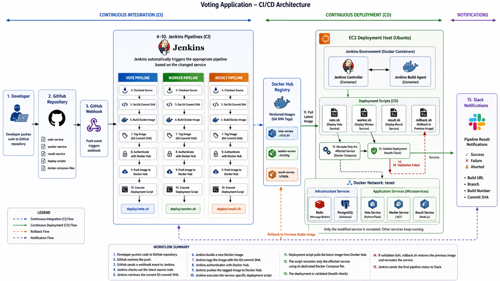
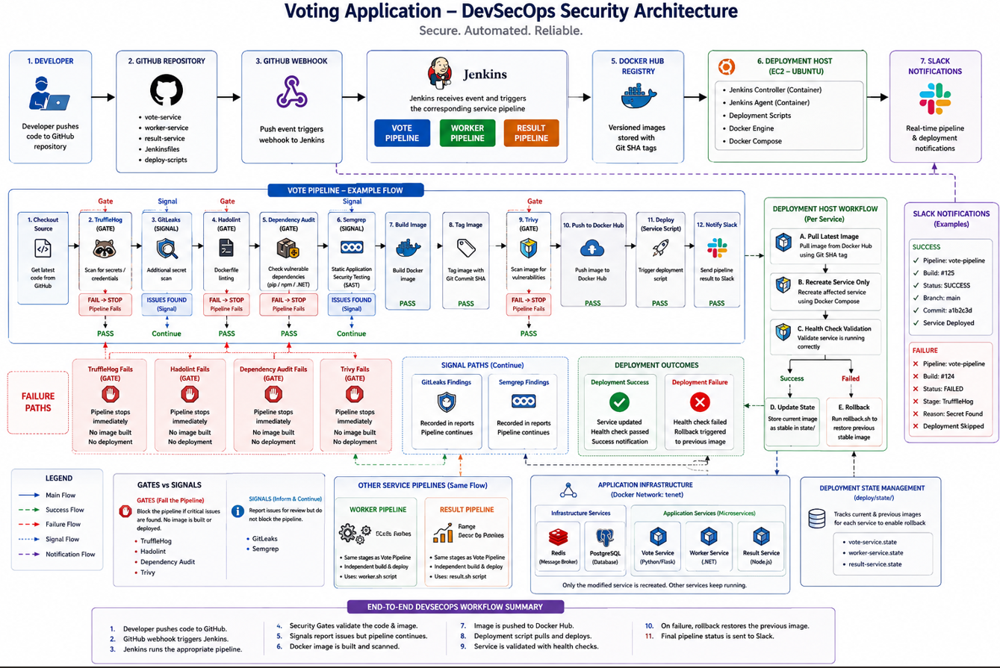
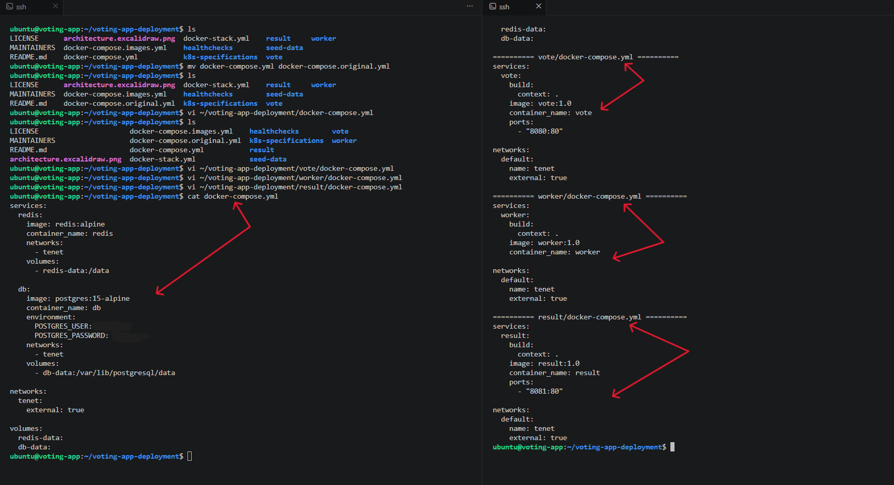

# Voting Application Deployment with Docker, Docker Compose, Jenkins CI/CD & DevSecOps

## 1. Project Overview

This project demonstrates the end-to-end deployment, automation, and security hardening of a three-tier microservices voting application using Docker, Docker Compose, Jenkins, GitHub, Docker Hub, Slack, and multiple DevSecOps security tools. The objective was to transform a manually deployed containerised application into a production-oriented Continuous Integration, Continuous Deployment, and DevSecOps solution capable of independently building, securing, publishing, and deploying each application service.

Unlike the original implementation, where all application services were managed from a single Docker Compose file, this project adopts a per-service deployment architecture. Each application component (**Vote**, **Worker**, and **Result**) has its own Docker Compose configuration, Jenkins pipeline, and deployment script, allowing services to be updated independently without interrupting the rest of the application.

The solution integrates GitHub Webhooks for automatic build triggering, Docker Hub as the central image registry, Slack notifications for real-time pipeline monitoring, an automated rollback mechanism to improve deployment reliability, and multiple security controls that validate every build before deployment.

By the end of the implementation, every Git push automatically triggers the appropriate Jenkins pipeline, performs secret scanning, Dockerfile linting, dependency auditing, static application security testing, container image vulnerability scanning, builds only the modified service, tags the Docker image using the current Git commit SHA, publishes the image to Docker Hub, deploys the updated container, validates the deployment, and sends the build status directly to Slack.

## Project Documentation

The project documentation has been organised into dedicated guides covering deployment, security implementation, security architecture, and operational procedures.

- **[README.md](README.md)** – Project overview, architecture, technology stack, and implementation summary.
- **[SETUP.md](SETUP.md)** – Step-by-step guide for implementing the original CI/CD pipeline.
- **[SECURITY-SETUP.md](SECURITY-SETUP.md)** – Step-by-step guide for hardening the CI/CD pipeline with DevSecOps security controls.
- **[SECURITY.md](SECURITY.md)** – Security design decisions, implemented security controls, Gate and Signal strategy, baseline management, and scanner verification.
- **[RUNBOOK.md](RUNBOOK.md)** – Procedures for responding to Gate and Signal findings, creating legitimate baselines, and requesting security exceptions.

## 2. Repository Structure

The repository has been organised to separate application services, deployment automation, security tooling, documentation, and supporting resources. Each microservice contains its own Dockerfile, Docker Compose configuration, and Jenkins pipeline, while deployment automation, rollback, and DevSecOps tooling are organised into dedicated directories to improve maintainability and scalability.

```text
voting-app-deployment/
├── deploy/
│   ├── result.sh
│   ├── rollback.sh
│   ├── state/
│   ├── vote.sh
│   └── worker.sh
├── extras/
│   ├── docker-stack.yml
│   ├── healthchecks/
│   ├── k8s-specifications/
│   └── seed-data/
├── result/
├── screenshots/
├── security/
│   ├── baselines/
│   ├── configs/
│   ├── dockerfiles/
│   ├── reports/
│   ├── screenshots/
│   └── scripts/
├── vote/
├── worker/
├── LICENSE
├── README.md
├── RUNBOOK.md
├── SECURITY.md
├── SECURITY-SETUP.md
├── SETUP.md
└── docker-compose.yml
```

The original project resources that were not required for the CI/CD and DevSecOps implementation have been moved into the `extras` directory, allowing the repository to focus on the deployment architecture, security implementation, and supporting documentation developed throughout this project.

## 3. Solution Architecture

The application follows a microservices architecture consisting of five interconnected services:

- **Vote Service** (Python/Flask) – Provides the web interface where users cast their votes.
- **Worker Service** (.NET) – Processes votes submitted by users and transfers them from Redis into PostgreSQL.
- **Result Service** (Node.js) – Retrieves processed voting results from PostgreSQL and displays them through the web interface.
- **Redis** – Acts as an in-memory message broker, temporarily storing incoming votes before they are processed.
- **PostgreSQL** – Serves as the application's persistent database, storing processed voting data for retrieval by the Result service.

The infrastructure is built around a shared Docker network, allowing all services to communicate securely while remaining independently deployable. The core infrastructure services (**Redis** and **PostgreSQL**) are managed through the root `docker-compose.yml`, while each application service (**Vote**, **Worker**, and **Result**) is deployed independently using its own Docker Compose configuration and Jenkins pipeline.

When code is pushed to GitHub, a webhook automatically triggers the appropriate Jenkins pipeline. Jenkins checks out the latest source code, builds a new Docker image, tags it using the current Git commit SHA, authenticates with Docker Hub, pushes the image to the registry, and executes the deployment script for the modified service.

The deployment script pulls the latest image from Docker Hub, recreates only the affected application service without interrupting the remaining containers, verifies that the deployment completed successfully, and automatically invokes the rollback script if validation fails. Throughout the deployment process, Slack provides real-time build notifications for every pipeline execution.



## 4. DevSecOps Security Architecture

Following the successful implementation of the CI/CD pipeline, the deployment workflow was further hardened by integrating DevSecOps practices directly into each Jenkins pipeline.

Before any Docker image is published or deployed, every pipeline automatically performs secret scanning, Dockerfile linting, dependency auditing, static application security testing, and container image vulnerability scanning. These security controls ensure that insecure code, exposed credentials, vulnerable dependencies, and container vulnerabilities are identified before deployment.

Security tools are executed from reusable automation scripts stored under the `security/scripts` directory and run inside dedicated Docker images defined within `security/dockerfiles`. This modular approach keeps the Jenkins pipelines concise while allowing individual security tools to be maintained independently.

The hardened pipeline executes the following workflow:

```text
GitHub Push
        │
        ▼
GitHub Webhook
        │
        ▼
Jenkins Pipeline
        │
        ├── TruffleHog
        ├── GitLeaks
        ├── Hadolint
        ├── Dependency Audit
        ├── Semgrep
        ├── Build Docker Image
        ├── Trivy
        ├── Push Docker Image
        ├── Deploy Service
        └── Slack Notification
```



## 5. Infrastructure Overview

The solution is hosted on a single **Ubuntu 24.04 Amazon EC2 instance** running in AWS.

Docker provides the container runtime for both the application services and the Jenkins environment, while Docker Compose manages the application containers. Redis and PostgreSQL provide the application's messaging and database layers through a shared external Docker network, allowing every service to communicate while remaining independently deployable.

The infrastructure consists of:

- Amazon EC2 (Ubuntu 24.04 LTS)
- Docker Engine
- Docker Compose
- Jenkins Controller (Docker Container)
- Jenkins Inbound Build Agent (Docker Container)
- Redis
- PostgreSQL
- GitHub
- Docker Hub
- Slack

## 6. Technology Stack

| Category | Technologies |
|----------|--------------|
| Cloud Platform | AWS EC2 (Ubuntu 24.04 LTS) |
| Containerisation | Docker, Docker Compose |
| CI/CD | Jenkins, Jenkins Inbound Agent |
| DevSecOps | TruffleHog, GitLeaks, Hadolint, Semgrep, Trivy, pip-audit, npm audit, .NET Dependency Audit |
| Source Control | Git, GitHub |
| Container Registry | Docker Hub |
| Automation | Bash |
| Notifications | Slack |
| Database | PostgreSQL 15 |
| Message Broker | Redis |
| Programming Languages | Python, C#, Node.js |
| Networking | Docker Bridge Network (tenet) |
| Image Versioning | Git Commit SHA Tagging |
| Deployment Strategy | Per-Service Continuous Deployment with Automated Rollback |
| Security Strategy | Gate and Signal Pipeline Validation |

## 7. Docker Containerization

The first phase of the project focused on containerising the complete voting application using Docker. Each application component was packaged into its own Docker image to ensure consistency across development and deployment environments.

The project consists of three application services:

- **Vote Service** – A Python Flask application that provides the voting interface.
- **Worker Service** – A .NET background service responsible for processing votes.
- **Result Service** – A Node.js application that displays the voting results.

Supporting infrastructure services were also deployed using official Docker images:

- **Redis** – Message broker used to temporarily store incoming votes.
- **PostgreSQL** – Relational database used to persist processed voting data.

Each service was successfully containerised, allowing the application to run consistently regardless of the underlying host environment.

The Docker images were verified before proceeding with orchestration.


## 8. Docker Compose Deployment

After successfully containerising the application, Docker Compose was used to orchestrate the deployment of all services.

Unlike the original implementation, this project adopts a **per-service deployment architecture**. The root `docker-compose.yml` manages only the shared infrastructure services (**Redis** and **PostgreSQL**), while each application service has its own dedicated Docker Compose configuration:

- `vote/docker-compose.yml`
- `worker/docker-compose.yml`
- `result/docker-compose.yml`

This architecture enables independent deployment of each service without affecting the remaining application components. During a deployment, Jenkins updates only the modified service while Redis, PostgreSQL, and the other application services continue running uninterrupted.

The application services communicate through the shared external Docker network (`tenet`), ensuring seamless communication between containers while maintaining deployment isolation.

The project structure below illustrates the separation of the Docker Compose configurations.



The complete application was then deployed using Docker Compose and verified to ensure that every service started successfully.


## 9. Jenkins Build Automation

To automate the build, security validation, and deployment process, Jenkins was deployed as a Docker container and configured as the project's Continuous Integration, Continuous Deployment, and DevSecOps platform.

Rather than manually building Docker images and deploying containers after every code change, Jenkins automates the complete workflow. Every Git push triggers the appropriate pipeline, which performs the following tasks:

- Checks out the latest source code from GitHub.
- Performs secret scanning using TruffleHog.
- Performs secret scanning using GitLeaks.
- Lints the service Dockerfile using Hadolint.
- Audits project dependencies for known vulnerabilities.
- Performs Static Application Security Testing (SAST) using Semgrep.
- Retrieves the current Git commit SHA.
- Builds the Docker image for the modified service.
- Tags the image using the Git commit SHA.
- Scans the Docker image using Trivy.
- Authenticates with Docker Hub.
- Pushes the newly built image to Docker Hub.
- Executes the corresponding deployment script.
- Sends build notifications to Slack.

Security validation is fully integrated into every Jenkins pipeline. Critical security issues identified by Gate stages immediately stop the pipeline before any Docker image is published or deployed, while Signal stages report findings for review without interrupting the deployment workflow.

This automation significantly reduces manual intervention while ensuring every deployment follows the same secure, repeatable, and production-oriented process.

Jenkins was successfully deployed and configured using Docker.


## 10. Jenkins Build Agent

To separate build execution from the Jenkins controller, a dedicated Jenkins Inbound Build Agent was provisioned as a Docker container.

The build agent is responsible for executing all pipeline stages, including security validation, Docker image builds, image tagging, Docker Hub publishing, and deployment script execution. Offloading builds to a dedicated agent improves scalability and follows Jenkins best practices by keeping the controller focused on orchestration rather than workload execution.

The Jenkins controller communicates securely with the build agent through the Jenkins remoting protocol, allowing all pipelines to execute on the agent while remaining centrally managed from the Jenkins dashboard.

The successful connection between the Jenkins controller and the build agent was verified before implementing the CI/CD and DevSecOps pipelines.

 

## 11. Per-Service CI/CD Pipeline Design

The project adopts a per-service CI/CD pipeline design, where each application component is managed independently through its own hardened Jenkins pipeline.

Three independent declarative Jenkins pipelines were implemented:

- **vote-pipeline**
- **worker-pipeline**
- **result-pipeline**

Each pipeline references its own service-specific `Jenkinsfile` and deployment script, ensuring that changes to one service trigger only its corresponding pipeline without affecting the remaining application components.

Rather than combining Continuous Integration (CI), Continuous Deployment (CD), and deployment logic into a single Jenkinsfile, responsibilities were deliberately separated to improve maintainability, scalability, and long-term flexibility.

The **Jenkinsfile** is responsible for orchestrating the CI and DevSecOps workflow. Its responsibilities include:

1. Checking out the latest source code from GitHub.
2. Performing secret scanning using TruffleHog.
3. Performing secret scanning using GitLeaks.
4. Linting the service Dockerfile using Hadolint.
5. Auditing application dependencies for known vulnerabilities.
6. Performing Static Application Security Testing (SAST) using Semgrep.
7. Retrieving the current Git commit SHA.
8. Building the Docker image.
9. Tagging the image using the Git commit SHA.
10. Scanning the Docker image using Trivy.
11. Authenticating with Docker Hub.
12. Publishing the tagged Docker image.
13. Executing the corresponding deployment script.
14. Sending the pipeline status to Slack.

Once the image has been successfully validated, built, and published, deployment is handed over to the corresponding service deployment script ([vote.sh](deploy/vote.sh), [worker.sh](deploy/worker.sh), or [result.sh](deploy/result.sh)).

Each deployment script is responsible for the Continuous Deployment (CD) phase by:

- Recording the currently deployed image version for rollback.
- Pulling the newly published Docker image from Docker Hub.
- Recreating only the affected application service using its dedicated Docker Compose configuration.
- Verifying that the updated service starts successfully.
- Updating the deployment state for future rollback operations.
- Automatically invoking `rollback.sh` if deployment validation fails.

The shared `rollback.sh` script restores the last successfully deployed image recorded within the `deploy/state/` directory, allowing services to recover automatically from failed deployments without affecting the remaining application components.

By separating pipeline orchestration, deployment, and rollback into dedicated components, the solution remains modular and easy to maintain. Future platform migrations, such as replacing Docker Compose with Kubernetes, would require changes primarily to the deployment scripts while leaving the Jenkins pipelines largely unchanged.

This architecture reduces deployment time, minimises service interruption, simplifies maintenance, and provides a repeatable deployment workflow suitable for production-oriented environments.


## 12. GitHub Integration

GitHub serves as the project's central source code repository, providing version control and acting as the single source of truth for the application source code, deployment scripts, infrastructure configuration, and DevSecOps automation.

Development was carried out on a dedicated feature branch (`feature/voting-app-cicd`), allowing the CI/CD and DevSecOps implementation to be completed and validated independently before being merged.

GitHub Webhooks provide event-driven pipeline execution by automatically notifying Jenkins whenever code is pushed to the repository. Jenkins securely authenticates with GitHub using a Personal Access Token (PAT), checks out the latest source code, and executes only the pipeline associated with the modified service.

This integration forms the entry point of the automated DevSecOps workflow by ensuring that every deployment begins with the latest version of the source code and immediately passes through the configured security controls before deployment.

## 13. Docker Hub Integration

Docker Hub serves as the project's private container registry, providing a central location for storing and distributing Docker images produced during the Jenkins pipelines.

After every successful security validation and Docker image build, Jenkins authenticates with Docker Hub using securely managed credentials before publishing the newly built image.

Each Docker image is tagged using the current Git commit SHA, ensuring every deployment references a unique, immutable image version while supporting traceability and reliable rollback.

The image publication workflow consists of:

1. Build the Docker image.
2. Tag the image using the current Git commit SHA.
3. Perform container image vulnerability scanning using Trivy.
4. Authenticate with Docker Hub.
5. Publish the tagged Docker image.
6. Log out of Docker Hub.

Because Docker images are published only after all configured Gate stages complete successfully, Docker Hub stores only validated application images that have successfully passed the pipeline security controls.


## 14. Automated Deployment & Rollback

Once Jenkins successfully completes all CI and DevSecOps validation stages, control is transferred to the service-specific deployment scripts responsible for Continuous Deployment.

Each deployment script performs the following tasks:

1. Preserve the currently deployed image version.
2. Pull the newly published Docker image from Docker Hub.
3. Recreate only the affected application service using its dedicated Docker Compose configuration.
4. Verify that the updated service started successfully.
5. Update the deployment state used for future rollback operations.
6. Automatically invoke the rollback script if deployment validation fails.

The deployment state is maintained within the `deploy/state/` directory, allowing each service to track both its current and previously deployed image versions independently.

If deployment validation fails, the shared `rollback.sh` script automatically restores the last successfully deployed image for the affected service. This approach minimises downtime, preserves application availability, and prevents failed deployments from leaving services in an inconsistent state.

Separating pipeline orchestration, deployment, rollback, and deployment state management into dedicated scripts keeps the Jenkins pipelines concise, reusable, and easier to maintain while allowing the deployment strategy to evolve independently from the CI process.

This modular architecture improves maintainability, simplifies troubleshooting, supports automated recovery from deployment failures, and provides a production-oriented deployment workflow suitable for modern DevSecOps environments.

## 15. GitHub Webhook Automation

GitHub Webhooks were configured to eliminate the need for manually triggering Jenkins builds.

Whenever code is pushed to the repository, GitHub immediately sends a webhook event to the Jenkins server. Jenkins receives the notification, identifies the appropriate service pipeline, checks out the latest source code, and begins the automated DevSecOps workflow.

Each pipeline automatically performs security validation, builds the Docker image, publishes the validated image to Docker Hub, deploys the updated service, and reports the build status to Slack without requiring manual intervention.

This event-driven approach enables fully automated Continuous Integration, Continuous Deployment, and DevSecOps while ensuring every code change passes through the configured security controls before deployment.

The webhook payload targets the Jenkins GitHub webhook endpoint and is configured to trigger on every push event.


## 16. Slack Notification Integration

Slack was integrated with Jenkins to provide real-time visibility into every pipeline execution.

The Jenkins Slack Notification Plugin was configured using a Slack Bot User OAuth Token stored securely as a Jenkins Secret Text credential. Once configured, each pipeline automatically posts notifications to the designated Slack channel after every execution.

Notifications are generated for both successful and failed pipeline executions and include:

- Pipeline status (Success, Failure, or Aborted)
- Jenkins job name
- Build number
- Source branch
- Direct link to the Jenkins build

This integration enables rapid monitoring of deployment activities and security validation results without requiring administrators to continuously access the Jenkins dashboard.


## 17. End-to-End DevSecOps Workflow

The completed solution provides a fully automated DevSecOps pipeline that begins with a source code change and ends with the successful deployment of a validated application service.

The workflow consists of the following stages:

1. A developer pushes code to the GitHub repository.
2. GitHub sends a webhook event to Jenkins.
3. Jenkins automatically triggers the corresponding service pipeline.
4. Jenkins checks out the latest source code.
5. TruffleHog performs verified secret scanning.
6. GitLeaks performs additional secret scanning.
7. Hadolint validates the service Dockerfile.
8. Project dependencies are audited for known vulnerabilities.
9. Semgrep performs Static Application Security Testing (SAST).
10. Jenkins retrieves the current Git commit SHA.
11. A new Docker image is built.
12. The image is tagged using the Git commit SHA.
13. Trivy scans the newly built Docker image for vulnerabilities.
14. Jenkins authenticates with Docker Hub.
15. The validated Docker image is published to Docker Hub.
16. The service-specific deployment script is executed.
17. The deployment script records the current deployment state.
18. The updated application service is deployed.
19. The deployment is validated.
20. If deployment validation fails, the rollback script restores the previous working image automatically.
21. Jenkins sends the final pipeline status to Slack.

This workflow provides a secure, repeatable, and production-oriented deployment process in which every application update is validated before deployment while remaining isolated to the modified service.


## 18. Project Validation

The completed solution was validated to confirm that every component of the DevSecOps pipeline functioned as expected.

The following implementation objectives were successfully achieved:

- Dockerised the complete three-tier voting application.
- Deployed Redis and PostgreSQL as shared infrastructure services.
- Implemented independent Docker Compose configurations for the Vote, Worker, and Result services.
- Provisioned a Jenkins Controller and Jenkins Inbound Build Agent using Docker.
- Created three independent declarative Jenkins pipelines.
- Integrated GitHub using secure Personal Access Token authentication.
- Configured GitHub Webhooks for automatic pipeline execution.
- Configured Docker Hub as the central container registry.
- Implemented Git commit SHA image versioning.
- Implemented automated deployment using service-specific deployment scripts.
- Implemented automated rollback with deployment state management.
- Integrated TruffleHog for verified secret scanning.
- Integrated GitLeaks for additional secret detection.
- Integrated Hadolint for Dockerfile linting.
- Integrated dependency auditing for Python, .NET, and Node.js services.
- Integrated Semgrep for Static Application Security Testing (SAST).
- Integrated Trivy for container image vulnerability scanning.
- Implemented Gate and Signal security controls throughout the pipelines.
- Integrated Slack notifications for real-time pipeline monitoring.
- Successfully validated the complete end-to-end DevSecOps workflow.

The successful execution of all three hardened pipelines demonstrates that the complete process—from source code commit through security validation, image publishing, deployment, rollback, and notification—operates automatically without manual intervention.


## 19. Conclusion

This project demonstrates the successful implementation of a production-oriented DevSecOps platform for a microservices-based voting application using Docker, Docker Compose, Jenkins, GitHub, Docker Hub, Slack, and automated security tooling.

By separating the application into independently deployable services, introducing dedicated Jenkins pipelines, integrating automated security validation, implementing deployment scripts with deployment state management and automated rollback, and automating the entire workflow through GitHub Webhooks and Slack notifications, the deployment process has evolved into a secure, reliable, repeatable, and fully automated DevSecOps pipeline.

The modular architecture adopted throughout this implementation improves scalability, simplifies maintenance, reduces deployment risk, and provides a solid foundation for future enhancements such as Kubernetes orchestration, Infrastructure as Code, policy enforcement, automated testing, and advanced deployment strategies.

For readers interested in reproducing the complete implementation, the project documentation has been organised into dedicated guides:

- **[README.md](README.md)** – Project overview, architecture, technology stack, and implementation summary.
- **[SETUP.md](SETUP.md)** – Step-by-step guide for implementing the original CI/CD pipeline.
- **[SECURITY-SETUP.md](SECURITY-SETUP.md)** – Step-by-step guide for hardening the CI/CD pipeline with DevSecOps security controls.
- **[SECURITY.md](SECURITY.md)** – Security design decisions, implemented security controls, Gate and Signal strategy, baseline management, and scanner verification.
- **[RUNBOOK.md](RUNBOOK.md)** – Procedures for responding to Gate and Signal findings, creating legitimate baselines, and requesting security exceptions
