# Security Setup Guide

This guide extends the CI/CD implementation completed in the project's main **[SETUP.md](SETUP.md)** by integrating automated security controls into the existing Jenkins pipelines. It demonstrates how DevSecOps practices can be incorporated into the Example Voting App using Docker-based security tooling, reusable automation scripts, and hardened Jenkins pipelines.

By completing this guide, the pipeline will be enhanced with automated secret scanning, Dockerfile linting, dependency auditing, static application security testing (SAST), container image vulnerability scanning, and security gate validation before Docker images are published or deployed.

**Prerequisite:** Complete the project's main **SETUP.md** before beginning this guide.

**Note:** This guide introduces security after the CI/CD pipeline has already been implemented purely for demonstration and learning purposes. In a production environment, security should be integrated throughout the software development lifecycle rather than added as a separate phase after the pipeline has been completed.

<details>
<summary><strong>Phase 1 – Project Preparation</strong></summary>

## 1. Create the Security Directory

To keep the CI Hardening implementation organised and maintainable, create a dedicated **security** directory inside the project root.

Navigate to the project directory.

```bash
cd ~/voting-app-deployment
```

Create the security directory.

```bash
mkdir security
```

Move into the newly created directory.

```bash
cd security
```

## 2. Create the Security Directory Structure

Create dedicated directories for security configuration files, baseline files, generated reports, project screenshots, Dockerfiles, and reusable automation scripts.

```bash
mkdir baselines configs reports screenshots dockerfiles scripts
```

The resulting directory structure should resemble the following.

```text
security/
├── baselines/
├── configs/
├── dockerfiles/
├── reports/
├── screenshots/
└── scripts/
```

The directories will be used as follows.

| Directory | Purpose |
|-----------|---------|
| `configs/` | Configuration files for each security tool (for example: `hadolint.yaml`, `.semgrepignore`, and Trivy configuration files) |
| `baselines/` | Baseline and allowlist files used by security scanners (for example: `gitleaks-baseline.json` and `.trivyignore`) |
| `dockerfiles/` | Dockerfiles used to build dedicated images for each security tool during pipeline hardening |
| `reports/` | Reports generated during security scans for validation and troubleshooting |
| `screenshots/` | Screenshots captured throughout the security implementation for documentation |
| `scripts/` | Reusable shell scripts executed by the Jenkins pipelines during automated security scanning |

> **Note:**
>
> Organising the project by file purpose rather than by individual security tool keeps the repository cleaner and easier to maintain. As additional security tools are introduced, their configuration files, Dockerfiles, reports, screenshots, and automation scripts can be stored in the appropriate directory without creating unnecessary folders.

## 3. Create the Security Documentation Files

Return to the project root.

```bash
cd ~/voting-app-deployment
```

Create the documentation files required for the CI Hardening implementation.

```bash
touch SECURITY.md RUNBOOK.md
```

These documents will be completed later in the implementation.

- **SECURITY.md** will document the security architecture, implemented scanners, Gate vs Signal decisions, baseline management, and security controls.
- **RUNBOOK.md** will document operational procedures, troubleshooting guidance, rollback procedures, and responses to security gate failures.

## 4. Verify the Repository Structure

Verify that the project structure has been updated successfully.

```bash
tree -L 2
```

The output should now include the following additions.

```text
SECURITY.md
RUNBOOK.md
security/
├── baselines/
├── configs/
├── dockerfiles/
├── reports/
├── screenshots/
└── scripts/
```

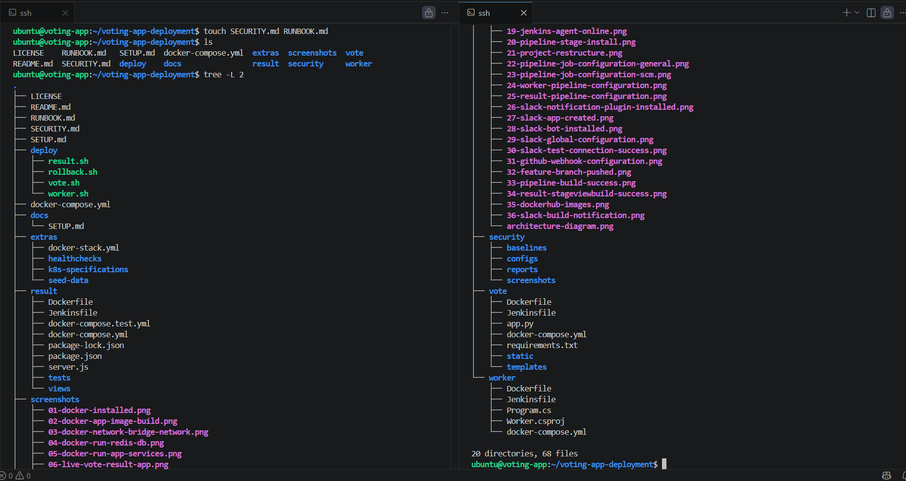

</details>

<details>
<summary><strong>Phase 2 – Pipeline Redesign</strong></summary>

The objective of this phase is to redesign the existing CI/CD pipeline to incorporate security controls before any Docker image is published or deployed.

Rather than implementing the security tools immediately, this phase focuses on defining the final hardened pipeline architecture that will be implemented throughout the remainder of this guide.

## 5. Redesign the Existing Jenkins Pipeline

The existing CI/CD pipeline executes in the following order.

```text
Checkout Source → Get Git Commit SHA → Build Docker Image → Tag Docker Image → Docker Hub Login → Push Docker Image → Docker Hub Logout → Deploy Service → Slack Notification
```

This workflow successfully automates the build and deployment process. However, it does not verify the security of the source code, dependencies, Dockerfiles, or container images before deployment.

The hardened pipeline will therefore execute in the following order.

```text
Checkout Source → Secret Scan (TruffleHog) → Secret Scan (GitLeaks) → Dockerfile Lint (Hadolint) → Dependency Audit → Static Code Analysis (Semgrep) → Get Git Commit SHA → Build Docker Image → Tag Docker Image → Image Vulnerability Scan (Trivy) → Docker Hub Login → Push Docker Image → Docker Hub Logout → Deploy Service → Slack Notification
```

This redesigned workflow ensures that multiple security and quality checks are completed before any Docker image is published to Docker Hub or deployed to the target environment.

## 6. Define Security Gates and Signals

Each security stage is classified as either a **Gate** or a **Signal**.

A **Gate** immediately stops the pipeline whenever a critical security issue is detected. This prevents vulnerable Docker images from being published or deployed.

A **Signal** reports findings and warnings to the Jenkins build log while allowing the pipeline to continue. These findings should still be reviewed and addressed, but they do not prevent deployment.

The security stages used throughout this project are classified as follows.

| Pipeline Stage | Security Tool | Type |
|----------------|---------------|------|
| Secret Scan | TruffleHog | Gate |
| Secret Scan | GitLeaks | Signal |
| Dockerfile Lint | Hadolint | Signal |
| Dependency Audit | pip-audit / npm audit / .NET Dependency Audit | Signal (Legacy Dependencies in Example Voting App) |
| Static Code Analysis | Semgrep | Signal |
| Image Vulnerability Scan | Trivy | Signal (Legacy Dependencies in Example Voting App) |

## 7. Create the Security Scripts Directory

To keep the Jenkins pipelines simple and maintainable, each security tool will be executed from its own shell script rather than embedding lengthy Docker commands directly inside the Jenkinsfiles.

Navigate to the existing `security` directory.

```bash
cd ~/voting-app-deployment/security
```

Create the security scripts.

```bash
touch scripts/trufflehog.sh \
scripts/gitleaks.sh \
scripts/hadolint.sh \
scripts/dependency-audit.sh \
scripts/semgrep.sh \
scripts/trivy.sh
```

Verify the updated directory structure.

```bash
tree
```

The structure should now resemble the following.

```text
security/
├── baselines/
├── configs/
├── dockerfiles/
├── reports/
├── screenshots/
└── scripts/
    ├── trufflehog.sh
    ├── gitleaks.sh
    ├── hadolint.sh
    ├── dependency-audit.sh
    ├── semgrep.sh
    └── trivy.sh
```

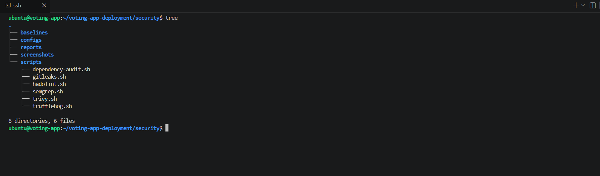

> **Note:**
>
> Rather than embedding every security command directly inside each Jenkinsfile, the Jenkins pipelines invoke the appropriate script from the `security/scripts` directory. This approach keeps the Jenkinsfiles concise, improves readability, simplifies future maintenance, and allows individual security tools to be updated independently without modifying every pipeline.

</details>

<details>
<summary><strong>Phase 3 – Security Tool Implementation</strong></summary>

## 8. Configure TruffleHog

TruffleHog will be used to scan the repository for verified secrets such as API keys, access tokens, passwords, and private keys before the Docker image is built.

Throughout this project, TruffleHog functions as a **Gate**. If a verified secret is detected, the pipeline immediately stops to prevent the build from continuing.

Navigate to the project root.

```bash
cd ~/voting-app-deployment
```

Run TruffleHog using its official Docker image.

```bash
docker run --rm -v "$PWD:/repo" trufflesecurity/trufflehog:latest filesystem /repo
```

Confirm that the scan completes successfully. The repository should report **0 Verified Secrets**. Depending on the project contents, **Unverified Secrets** may still be reported and should be reviewed individually.

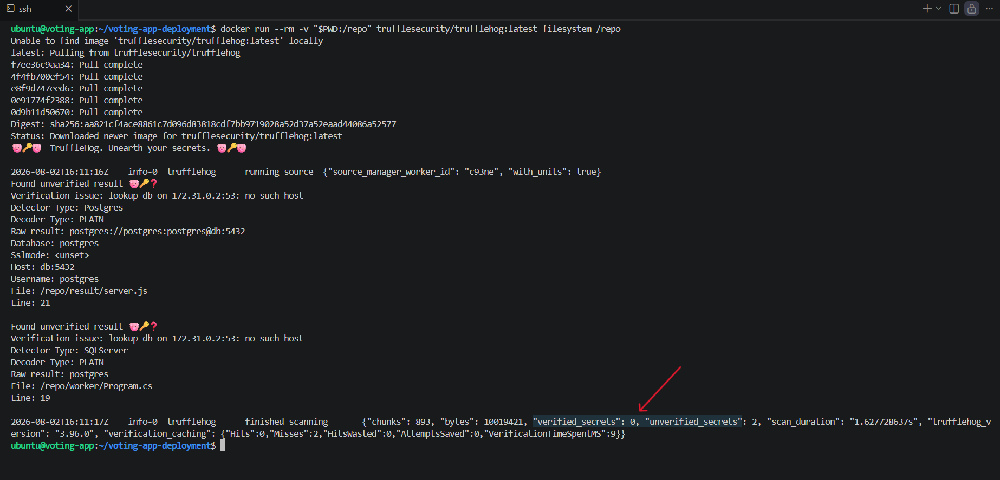

Create a temporary file containing a GitHub Personal Access Token for testing.

```bash
cat > test-secret.txt <<EOF
GITHUB_TOKEN=<YOUR_GITHUB_PERSONAL_ACCESS_TOKEN>
EOF
```

> **Note:**
>
> Use a temporary GitHub Personal Access Token that you own for this validation. The token should be revoked immediately after completing the test.

Run the TruffleHog scan again.

```bash
docker run --rm -v "$PWD:/repo" trufflesecurity/trufflehog:latest filesystem /repo
```

Confirm that TruffleHog successfully verifies the GitHub Personal Access Token and reports it as a **Verified Secret**.

Remove the temporary test file.

```bash
rm test-secret.txt
```

> **Note:**
>
> If a real credential was used during testing, revoke or rotate it immediately after completing the validation. Never reuse credentials that have been intentionally exposed during security testing.

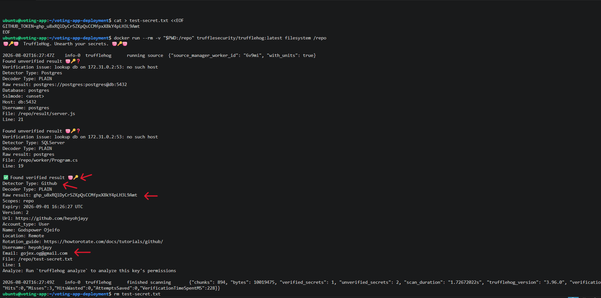

## 9. Configure GitLeaks

GitLeaks will be used to identify potential hardcoded secrets within the repository. Unlike TruffleHog, GitLeaks functions as a **Signal**, allowing the pipeline to continue while reporting any findings for review.

From the project root, run GitLeaks using its official Docker image.

```bash
docker run --rm -v "$PWD:/repo" ghcr.io/gitleaks/gitleaks:latest detect --source="/repo"
```

Confirm that the scan completes successfully with no secrets detected.

Generate a baseline report for the repository.

```bash
docker run --rm \
-v "$PWD:/repo" \
-v "$PWD/security/baselines:/output" \
ghcr.io/gitleaks/gitleaks:latest detect \
--source="/repo" \
--report-format=json \
--report-path=/output/gitleaks-baseline.json
```

Verify that the baseline report has been created successfully.

```bash
ls security/baselines
```

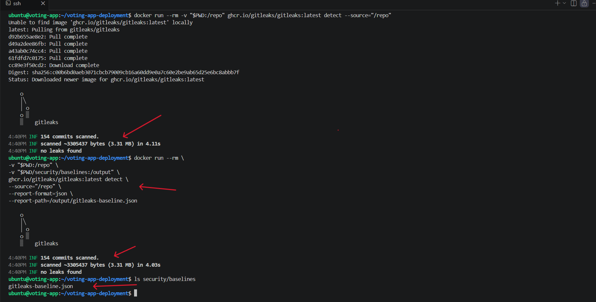

Create a temporary file containing the same GitHub Personal Access Token used during the TruffleHog validation.

```bash
cat > test-secret.txt <<EOF
GITHUB_TOKEN=<YOUR_GITHUB_PERSONAL_ACCESS_TOKEN>
EOF
```

> **Note:**
>
> Use the same temporary GitHub Personal Access Token created for the TruffleHog validation. The token will be revoked after all manual security tool validations have been completed.

Run GitLeaks in repository scanning mode.

```bash
docker run --rm -v "$PWD:/repo" ghcr.io/gitleaks/gitleaks:latest detect --source="/repo"
```

Run GitLeaks in directory scanning mode.

```bash
docker run --rm \
-v "$PWD:/repo" \
ghcr.io/gitleaks/gitleaks:latest \
dir /repo -v
```

Confirm that GitLeaks detects the GitHub Personal Access Token and reports it as a leaked secret.

Remove the temporary test file.

```bash
rm test-secret.txt
```

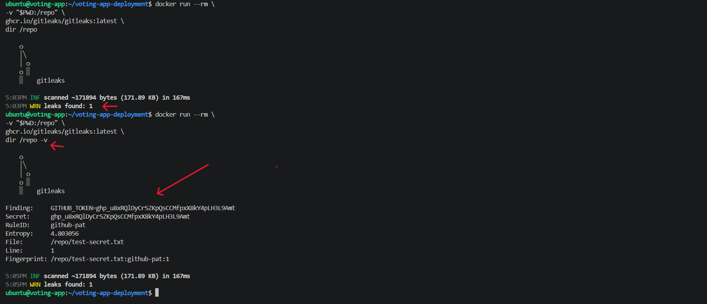

## 10. Configure Hadolint

Hadolint will be used to identify Dockerfile issues and Docker best practice violations within each application's Dockerfile. Throughout this project, Hadolint functions as a **Signal**, allowing the pipeline to continue while reporting recommendations for improvement.

Navigate to the project root.

```bash
cd ~/voting-app-deployment
```

Run Hadolint against the Vote service Dockerfile.

```bash
docker run --rm -i hadolint/hadolint < vote/Dockerfile
```

Run Hadolint against the Worker service Dockerfile.

```bash
docker run --rm -i hadolint/hadolint < worker/Dockerfile
```

Run Hadolint against the Result service Dockerfile.

```bash
docker run --rm -i hadolint/hadolint < result/Dockerfile
```

Review the reported findings and correct any issues before continuing.

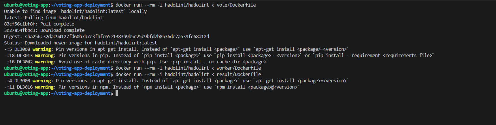

## 11. Configure Dependency Audit

Dependency auditing will be used to identify known vulnerabilities within each application's dependencies before the Docker image is built.

This project uses the following dependency auditing tools:

- **pip-audit** for the Vote (Python) service
- **.NET Dependency Audit** for the Worker (.NET) service
- **npm audit** for the Result (Node.js) service

Throughout this project, **Dependency Audit** functions as a **Signal**. Any discovered vulnerabilities are reported for review while allowing the pipeline to continue.

This design decision was made because the project is based on Docker's **Example Voting App**, which contains legacy third-party dependencies that are known to report vulnerabilities during dependency scanning. The purpose of this stage is to provide visibility into dependency-related risks while demonstrating how dependency auditing is integrated into a production-oriented CI/CD pipeline.

Navigate to the project root.

```bash
cd ~/voting-app-deployment
```

Run a dependency audit for the Vote service.

```bash
docker run --rm \
-v "$PWD/vote:/src" \
python:3.13-slim \
sh -c "pip install --no-cache-dir pip-audit && cd /src && pip-audit"
```

Run a dependency audit for the Worker service.

```bash
docker run --rm \
-v "$PWD/worker:/src" \
mcr.microsoft.com/dotnet/sdk:8.0 \
sh -c "cd /src && dotnet restore && dotnet list package --vulnerable"
```

Run a dependency audit for the Result service.

```bash
docker run --rm \
-v "$PWD/result:/src" \
node:22 \
sh -c "cd /src && npm install && npm audit --audit-level=high"
```

Review the audit results for each service.

Confirm that no High or Critical vulnerabilities are detected before proceeding.

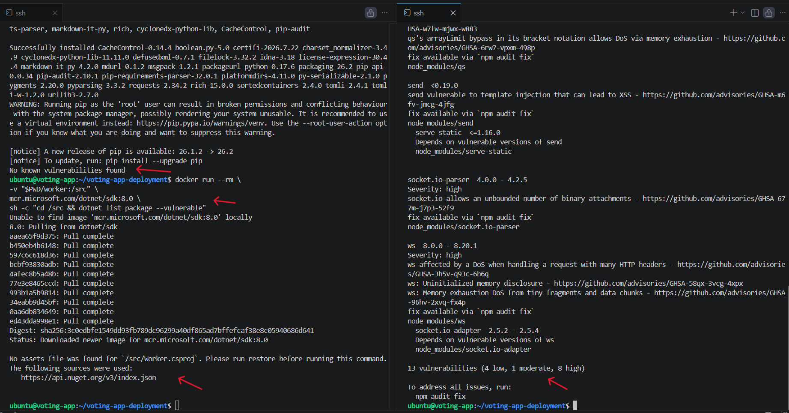

> **Note:**
>
> During the manual validation phase, the Python dependency audit installs `pip-audit` each time the container is executed. As a result, the initial output contains package installation logs before the audit results are displayed.
>
> In **Phase 4 – Pipeline Hardening**, dedicated Docker images will be created for each security tool. This eliminates the repeated installation process, significantly reduces console output, and provides a cleaner, faster, and more maintainable implementation for the automated Jenkins pipelines.

## 12. Configure Semgrep

Semgrep will be used to perform static code analysis by identifying insecure coding patterns, potential security vulnerabilities, and violations of secure coding best practices across the application source code.

Throughout this project, Semgrep functions as a **Signal**, allowing the pipeline to continue while reporting findings for review.

Navigate to the project root.

```bash
cd ~/voting-app-deployment
```

Run Semgrep using its official Docker image and save the scan results to a report.

```bash
docker run --rm \
-v "$PWD:/src" \
semgrep/semgrep \
semgrep scan --config=auto > security/reports/semgrep-report.txt
```

Review the generated report.

```bash
tail -40 security/reports/semgrep-report.txt
```

Confirm that the scan completed successfully and review any reported findings.

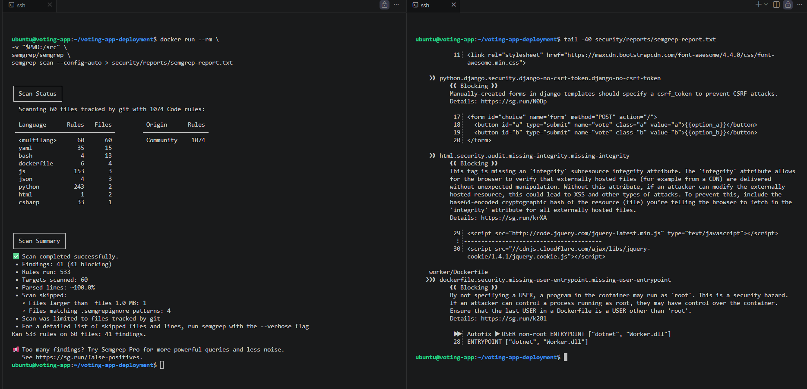

> **Note:**
>
> Saving the scan output to a report file keeps the terminal output concise while preserving the complete scan results for later review. During **Phase 4 – Pipeline Hardening**, Jenkins will archive these reports automatically as build artifacts.

## 13. Configure Trivy

Trivy will be used to scan Docker images for known operating system and application dependency vulnerabilities before they are published to Docker Hub.

Throughout this project, Trivy functions as a **Signal**. Any detected vulnerabilities are reported for review while allowing the pipeline to continue.

Verify that the application images have already been built.

```bash
docker images
```

Run a vulnerability scan against the Vote service image and save the report.

```bash
docker run --rm \
-v /var/run/docker.sock:/var/run/docker.sock \
-v "$PWD/security/reports:/reports" \
aquasec/trivy image vote:1.0 > security/reports/trivy-vote-report.txt
```

Review the scan summary.

```bash
tail -40 security/reports/trivy-vote-report.txt
```

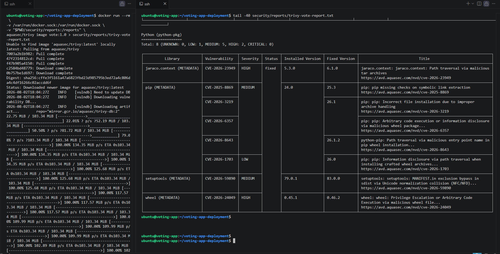

Repeat the scan for the Worker service.

```bash
docker run --rm \
-v /var/run/docker.sock:/var/run/docker.sock \
-v "$PWD/security/reports:/reports" \
aquasec/trivy image worker:1.0 > security/reports/trivy-worker-report.txt
```

Review the scan summary.

```bash
tail -40 security/reports/trivy-worker-report.txt
```

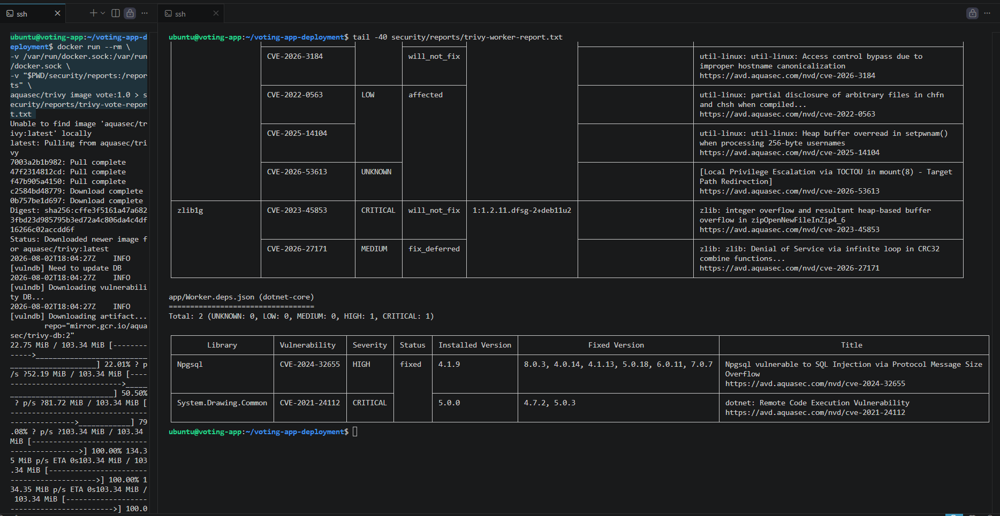

Repeat the scan for the Result service.

```bash
docker run --rm \
-v /var/run/docker.sock:/var/run/docker.sock \
-v "$PWD/security/reports:/reports" \
aquasec/trivy image result:1.0 > security/reports/trivy-result-report.txt
```

Review the scan summary.

```bash
tail -40 security/reports/trivy-result-report.txt
```

Confirm that the scan completed successfully and review any reported High or Critical vulnerabilities before proceeding.

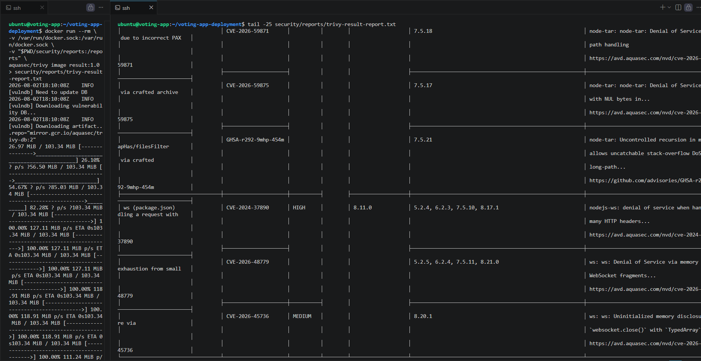

> **Note:**
>
> Trivy reports are written to the `security/reports` directory instead of being displayed directly in the terminal. This preserves the complete scan results and keeps the terminal output concise.
>
> Since this project is based on Docker's **Example Voting App**, the scans report known vulnerabilities originating from the upstream application and its base images. For this reason, **Trivy** is configured as a **Signal** throughout this project, allowing the pipeline to continue while reporting the findings for review.
>
> In **Phase 4 – Pipeline Hardening**, dedicated Docker images will be be created for each security tool and Jenkins will archive the generated reports as build artifacts.

</details>

<details>
<summary><strong>Phase 4 – Harden the Jenkins Pipelines</strong></summary>

Before integrating the security tools into the Jenkins pipelines, clean up the temporary resources created during the manual validation phase. This ensures the automation phase starts from a clean environment while preserving the running application and Jenkins infrastructure.

## 14. Clean Up the Manual Validation Environment

Remove the temporary test secret used during the TruffleHog and GitLeaks validation.

```bash
rm -f test-secret.txt
```

Remove the temporary JSON baseline generated during the GitLeaks validation.

```bash
rm -f security/baselines/gitleaks-baseline.json
```

Remove the temporary text reports generated during the Trivy validation.

```bash
rm -f security/reports/*
```

Remove the temporary security tool images downloaded during the manual validation phase.

```bash
docker rmi \
trufflesecurity/trufflehog:latest \
ghcr.io/gitleaks/gitleaks:latest \
hadolint/hadolint:latest \
semgrep/semgrep:latest \
aquasec/trivy:latest
```

Remove the temporary language runtime images used during the manual dependency audit.

```bash
docker rmi \
python:3.13-slim \
node:22 \
mcr.microsoft.com/dotnet/sdk:8.0
```

Remove the locally-built application images created during the manual validation phase.

```bash
docker rmi \
vote:1.0 \
worker:1.0 \
result:1.0
```

Verify that only the required application, Jenkins, and infrastructure images remain.

```bash
docker images
```

Verify that all required containers are still running.

```bash
docker ps
```

The following containers should remain online.

- jenkins
- jenkins-agent
- redis
- db
- vote
- worker
- result

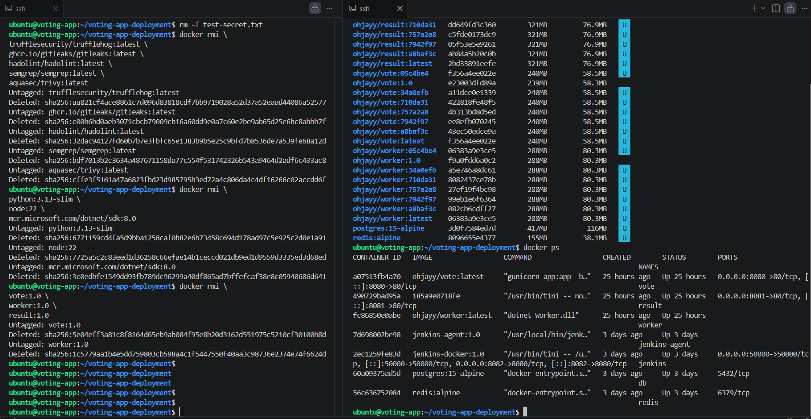

## 15. Create the Security Tool Dockerfiles

To simplify the Jenkins pipelines and eliminate repeated package installations during every build, each security tool will be packaged inside its own dedicated Docker image.

All security tool Dockerfiles will be stored under:

```text
security/dockerfiles/
```

Navigate to the Dockerfiles directory.

```bash
cd ~/voting-app-deployment/security/dockerfiles
```

Create the Dockerfiles.

```bash
touch Dockerfile.trufflehog \
Dockerfile.gitleaks \
Dockerfile.hadolint \
Dockerfile.dependency-audit \
Dockerfile.semgrep \
Dockerfile.trivy
```

Open the TruffleHog Dockerfile.

```bash
vi Dockerfile.trufflehog
```

<details>
<summary><strong>Dockerfile.trufflehog</strong></summary>

```dockerfile
FROM trufflesecurity/trufflehog:latest

WORKDIR /workspace

ENTRYPOINT ["trufflehog"]
```

</details>

Open the GitLeaks Dockerfile.

```bash
vi Dockerfile.gitleaks
```

<details>
<summary><strong>Dockerfile.gitleaks</strong></summary>

```dockerfile
FROM ghcr.io/gitleaks/gitleaks:latest

WORKDIR /workspace

ENTRYPOINT ["gitleaks"]
```

</details>

Open the Hadolint Dockerfile.

```bash
vi Dockerfile.hadolint
```

<details>
<summary><strong>Dockerfile.hadolint</strong></summary>

```dockerfile
FROM hadolint/hadolint:latest

WORKDIR /workspace

ENTRYPOINT ["hadolint"]
```

</details>

Open the Dependency Audit Dockerfile.

```bash
vi Dockerfile.dependency-audit
```

<details>
<summary><strong>Dockerfile.dependency-audit</strong></summary>

```dockerfile
FROM mcr.microsoft.com/dotnet/sdk:8.0

RUN apt-get update && \
    apt-get install -y curl python3 python3-pip && \
    curl -fsSL https://deb.nodesource.com/setup_22.x | bash - && \
    apt-get install -y nodejs && \
    pip3 install --break-system-packages pip-audit && \
    npm install -g audit-ci && \
    rm -rf /var/lib/apt/lists/*

WORKDIR /workspace
```

Since this image needs to support Python, Node.js, and .NET simultaneously, it is built as a custom image rather than inheriting directly from a single language runtime.

</details>

Open the Semgrep Dockerfile.

```bash
vi Dockerfile.semgrep
```

<details>
<summary><strong>Dockerfile.semgrep</strong></summary>

```dockerfile
FROM semgrep/semgrep:latest

WORKDIR /workspace

ENTRYPOINT ["semgrep"]
```

</details>

Open the Trivy Dockerfile.

```bash
vi Dockerfile.trivy
```

<details>
<summary><strong>Dockerfile.trivy</strong></summary>

```dockerfile
FROM aquasec/trivy:latest

WORKDIR /workspace

ENTRYPOINT ["trivy"]
```

</details>

Verify that all Dockerfiles have been created successfully.

```bash
ls -l
```

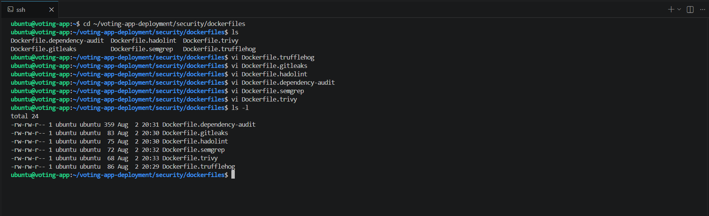

## 16. Build the Security Tool Images

Navigate to the project root.

```bash
cd ~/voting-app-deployment
```

Build the TruffleHog image.

```bash
docker build \
-f security/dockerfiles/Dockerfile.trufflehog \
-t security-trufflehog:1.0 .
```

Build the GitLeaks image.

```bash
docker build \
-f security/dockerfiles/Dockerfile.gitleaks \
-t security-gitleaks:1.0 .
```

Build the Hadolint image.

```bash
docker build \
-f security/dockerfiles/Dockerfile.hadolint \
-t security-hadolint:1.0 .
```

Build the Dependency Audit image.

```bash
docker build \
-f security/dockerfiles/Dockerfile.dependency-audit \
-t security-dependency-audit:1.0 .
```

Build the Semgrep image.

```bash
docker build \
-f security/dockerfiles/Dockerfile.semgrep \
-t security-semgrep:1.0 .
```

Build the Trivy image.

```bash
docker build \
-f security/dockerfiles/Dockerfile.trivy \
-t security-trivy:1.0 .
```

Verify that all images have been created successfully.

```bash
docker images
```

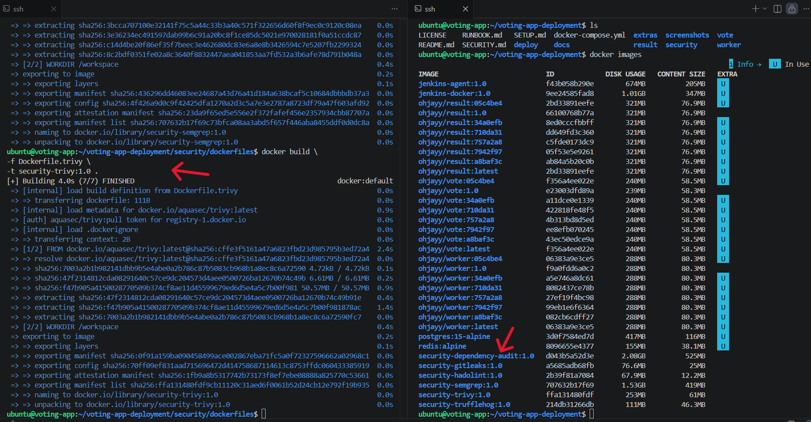

## 18. Update the Security Automation Scripts

With the security tool images now built, create the reusable automation scripts that will be executed by the Jenkins pipelines.

Each script performs one security task only. Rather than embedding lengthy Docker commands directly inside the Jenkinsfiles, every pipeline simply calls these reusable scripts.

This approach keeps the pipelines cleaner, easier to maintain, and allows individual security tools to be updated without modifying the Jenkins pipeline itself.

Navigate to the scripts directory.

```bash
cd ~/voting-app-deployment/security/scripts
```

Open the TruffleHog script.

```bash
vi trufflehog.sh
```

<details>
<summary><strong>trufflehog.sh</strong></summary>

```bash
#!/bin/bash

# Exit immediately if any command fails.
# Since TruffleHog is configured as a Gate, any failure should stop the pipeline.
set -e

# Jenkins automatically provides the WORKSPACE environment variable.
# WORKSPACE points to the root directory of the repository that Jenkins
# has checked out for the current build.
#
# Mount the repository into the container so TruffleHog can scan
# the entire source tree for verified secrets.
docker run --rm \
-v "$WORKSPACE:/repo" \
security-trufflehog:1.0 \
filesystem /repo
```

</details>

Open the GitLeaks script.

```bash
vi gitleaks.sh
```

<details>
<summary><strong>gitleaks.sh</strong></summary>

```bash
#!/bin/bash

# Exit immediately if any command fails.
set -e

# GitLeaks scans the repository for potential hardcoded secrets.
#
# In this project GitLeaks acts as a Signal rather than a Gate.
# Findings are reported for review while allowing the pipeline
# to continue.
docker run --rm \
-v "$WORKSPACE:/repo" \
security-gitleaks:1.0 \
dir /repo
```

</details>

Open the Hadolint script.

```bash
vi hadolint.sh
```

<details>
<summary><strong>hadolint.sh</strong></summary>

```bash
#!/bin/bash

# Exit immediately if any command fails.
set -e

# Jenkins passes the SERVICE environment variable to indicate
# which application is currently being built.
#
# SERVICE=vote
# SERVICE=worker
# SERVICE=result
#
# The corresponding Dockerfile is then linted automatically.
docker run --rm -i \
security-hadolint:1.0 < "$WORKSPACE/$SERVICE/Dockerfile"
```

</details>

Open the Dependency Audit script.

```bash
vi dependency-audit.sh
```

<details>
<summary><strong>dependency-audit.sh</strong></summary>

```bash
#!/bin/bash

# Exit immediately if any command fails.
set -e

# Each service uses a different technology stack and therefore
# requires a different dependency auditing tool.
#
# Vote    -> pip-audit
# Worker  -> dotnet list package --vulnerable
# Result  -> npm audit
#
# Jenkins passes the SERVICE environment variable so one reusable
# script can support all three pipelines.

case "$SERVICE" in

vote)

docker run --rm \
-v "$WORKSPACE/vote:/src" \
security-dependency-audit:1.0 \
sh -c "cd /src && pip-audit"

;;

worker)

docker run --rm \
-v "$WORKSPACE/worker:/src" \
security-dependency-audit:1.0 \
sh -c "cd /src && dotnet restore && dotnet list package --vulnerable"

;;

result)

docker run --rm \
-v "$WORKSPACE/result:/src" \
security-dependency-audit:1.0 \
sh -c "cd /src && npm install && npm audit --audit-level=high"

;;

*)

echo "Unknown service."

exit 1

;;

esac
```

</details>

Open the Semgrep script.

```bash
vi semgrep.sh
```

<details>
<summary><strong>semgrep.sh</strong></summary>

```bash
#!/bin/bash

# Exit immediately if any command fails.
set -e

# Semgrep performs Static Application Security Testing (SAST)
# by analysing the application's source code.
#
# The repository is mounted into the container so every supported
# source file can be inspected.
#
# The auto configuration downloads an appropriate ruleset based
# on the technologies detected within the repository.
docker run --rm \
-v "$WORKSPACE:/src" \
security-semgrep:1.0 \
semgrep scan --config=auto
```

</details>

Open the Trivy script.

```bash
vi trivy.sh
```

<details>
<summary><strong>trivy.sh</strong></summary>

```bash
#!/bin/bash

# Exit immediately if any command fails.
set -e

# Trivy scans the Docker image built during the current pipeline
# for known operating system and application dependency vulnerabilities.
#
# Jenkins passes the IMAGE_NAME environment variable to identify
# the image that should be scanned.
#
# Example:
#
# IMAGE_NAME=ohjayy/vote:05c4be4
#
# The Docker socket is mounted so Trivy can inspect the locally
# built image directly without pulling it from Docker Hub.
docker run --rm \
-v /var/run/docker.sock:/var/run/docker.sock \
security-trivy:1.0 \
image "$IMAGE_NAME"
```

</details>

Grant execute permission to every script.

```bash
chmod +x *.sh
```

Verify the updated permissions.

```bash
ls -l
```

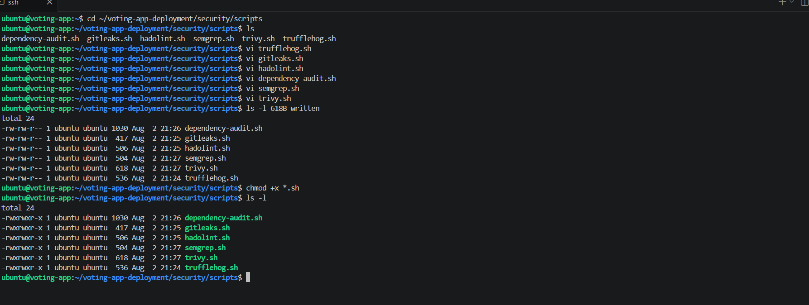

## 19. Integrate Security into the Vote Pipeline

Update the Vote service Jenkins pipeline to include the security stages before building and deploying the application.

The hardened pipeline executes the following stages.

```text
Checkout Source → Secret Scan (TruffleHog) → Secret Scan (GitLeaks) → Dockerfile Lint (Hadolint) → Dependency Audit → Static Code Analysis (Semgrep) → Get Git Commit SHA → Build Docker Image → Image Vulnerability Scan (Trivy) → Docker Hub Login → Push Docker Image → Docker Hub Logout → Deploy Service → Slack Notification
```

Navigate to the Vote service.

```bash
cd ~/voting-app-deployment/vote
```

Open the existing Jenkinsfile.

```bash
vi Jenkinsfile
```

Replace the existing Jenkinsfile with the hardened implementation available in **[`vote/Jenkinsfile`](vote/Jenkinsfile)**.

Copy the contents of that file into your local `vote/Jenkinsfile`, then save and exit the editor.

```bash
:wq
```

## 20. Integrate Security into the Worker Pipeline

Navigate to the Worker service.

```bash
cd ~/voting-app-deployment/worker
```

Open the existing Jenkinsfile.

```bash
vi Jenkinsfile
```

Replace the existing Jenkinsfile with the hardened implementation available in **[`worker/Jenkinsfile`](worker/Jenkinsfile)**.

Copy the contents of that file into your local `worker/Jenkinsfile`, then save and exit the editor.

```bash
:wq
```

## 21. Integrate Security into the Result Pipeline

Navigate to the Result service.

```bash
cd ~/voting-app-deployment/result
```

Open the existing Jenkinsfile.

```bash
vi Jenkinsfile
```

Replace the existing Jenkinsfile with the hardened implementation available in **[`result/Jenkinsfile`](result/Jenkinsfile)**.

Copy the contents of that file into your local `result/Jenkinsfile`, then save and exit the editor.

```bash
:wq
```

</details>

<details>
<summary><strong>Phase 5 – End-to-End Validation</strong></summary>

## 22. Perform End-to-End Pipeline Validation

With the security implementation complete, commit and push the updated project to GitHub. The configured GitHub webhook will automatically trigger the Jenkins pipelines.

Stage all project changes.

```bash
git add .
```

Commit the changes.

```bash
git commit -m "Implement DevSecOps pipeline hardening"
```

Push the changes to the remote repository.

```bash
git push origin feature/voting-app-cicd
```

Open the Jenkins Dashboard and verify that the following pipelines are triggered automatically.

- vote-pipeline
- worker-pipeline
- result-pipeline

For each pipeline, confirm that the stages execute in the following order.

```text
Checkout Source
→ Secret Scan (TruffleHog)
→ Secret Scan (GitLeaks)
→ Dockerfile Lint (Hadolint)
→ Dependency Audit
→ Static Code Analysis (Semgrep)
→ Get Git Commit SHA
→ Build Docker Image
→ Tag Docker Image
→ Image Vulnerability Scan (Trivy)
→ Docker Hub Login
→ Push Docker Image
→ Docker Hub Logout
→ Deploy Service
→ Slack Notification
```

Confirm that:

- Secret Scanning completes successfully.
- Dockerfile Linting completes successfully.
- Dependency Auditing completes successfully.
- Static Code Analysis completes successfully.
- Docker Image Build completes successfully.
- Image Vulnerability Scan completes successfully.
- Docker Hub receives the newly tagged image.
- The updated application is deployed successfully.
- Slack receives a successful build notification.

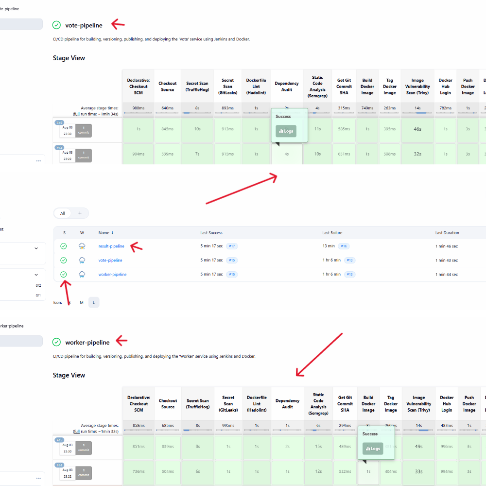

## 23. Validate Security Gates and Rollback

Deliberately introduce a temporary GitHub Personal Access Token into the repository to verify that the security controls prevent insecure code from progressing through the pipeline.

Create a temporary test file.

```bash
cat > test-secret.txt <<EOF
GITHUB_TOKEN=<YOUR_GITHUB_PERSONAL_ACCESS_TOKEN>
EOF
```

Stage the change.

```bash
git add .
```

Commit the temporary test file.

```bash
git commit -m "Validate security gate"
```

Push the change to GitHub.

```bash
git push origin feature/voting-app-cicd
```

The GitHub webhook automatically triggers the Jenkins pipeline.

Confirm that:

- TruffleHog immediately detects the verified secret.
- The pipeline stops before the Docker image is published.
- No new Docker image is pushed to Docker Hub.
- No new deployment is performed.
- The application continues running the previously deployed version, confirming that the rollback mechanism preserves the last known working deployment.

To verify this:

- Open the Jenkins Dashboard and confirm that the pipeline failed during the **Secret Scan (TruffleHog)** stage.
- Verify that the **Docker Hub Login**, **Push Docker Image**, and **Deploy Service** stages were not executed.
- Open the application in your web browser and confirm that the previously deployed version is still available and functioning correctly.
- Confirm that no new image tag has been added to the corresponding Docker Hub repository.

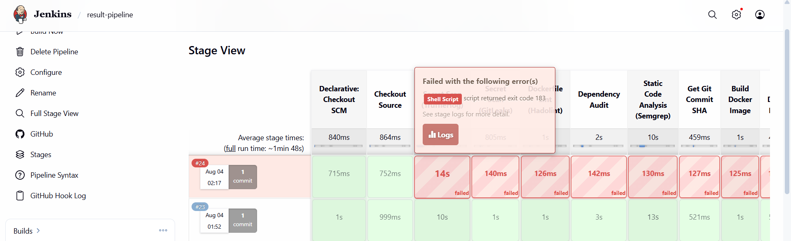

Remove the temporary test file.

```bash
rm test-secret.txt
```

Stage the change.

```bash
git add .
```

Commit the removal.

```bash
git commit -m "Remove temporary test secret"
```

Push the corrected code.

```bash
git push origin feature/voting-app-cicd
```

Confirm that:

- All security stages complete successfully.
- The Docker image is published successfully.
- The application is deployed successfully.
- Slack reports a successful pipeline execution.

To verify this:

- Open the Jenkins Dashboard and confirm that every stage completed successfully.
- Verify that a new Docker image tagged with the latest Git commit SHA has been published to Docker Hub.
- Open the deployed application and confirm that the latest changes are available.
- Verify that Slack received a successful build notification for the completed pipeline.


> **Note:**
>
> If a real GitHub Personal Access Token was used during validation, revoke or rotate it immediately after completing the security gate test. Never reuse credentials that have intentionally been exposed during testing.

## 24. Verify Docker Hub and Slack

Open Docker Hub.

Navigate to your repositories and verify that Docker images are published only after every **Gate** stage completes successfully.

Confirm that each successful pipeline publishes a newly tagged Docker image.


Open the **#jenkins-builds** Slack channel.

Verify that both successful and failed pipeline executions are reported correctly.

Confirm that each notification includes:

- Pipeline name
- Build number
- Build status
- Branch name
- Build URL


</details>
