# Step-by-Step Guide to Building and Automating the Voting Application with Docker, Docker Compose & Jenkins CI/CD

## Prerequisites

Before beginning this project, ensure the following requirements are met.

### Cloud Infrastructure

- AWS Account
- Ubuntu 24.04 LTS EC2 Instance
- Security Group configured to allow:
  - SSH (22)
  - HTTP (80)
  - TCP 8080
  - TCP 8081
  - TCP 8082
  - TCP 50000

### Software & Accounts

- GitHub Account
- Docker Hub Account
- Slack Workspace
- Visual Studio Code (or any preferred code editor)
- Git installed locally
- An SSH key pair for connecting to your EC2 instance

### Basic Knowledge

This guide assumes a basic understanding of:

- Linux command line
- Docker
- Docker Compose
- Git & GitHub
- Jenkins

## Understanding the Project Workflow

This project is intentionally completed in **two phases**.

### Phase 1 – Manual Docker Deployment

The first phase focuses on deploying the application manually. This helps you understand how the application works before introducing any automation.

During this phase, you will:

- Build the application Docker images manually.
- Create a Docker network.
- Deploy Redis and PostgreSQL.
- Deploy the Vote, Worker, and Result services.
- Verify that the complete application is working correctly.
- Remove the containers and images after validation.

Once you have successfully completed the manual deployment, you will have a solid understanding of how each container communicates with the others and how the application functions internally.

### Phase 2 – CI/CD Automation

The second phase builds upon the manual deployment by replacing manual operations with a fully automated CI/CD pipeline.

During this phase, you will:

- Deploy the application using Docker Compose.
- Configure Docker Hub as the container registry.
- Provision a Jenkins Controller.
- Configure a Jenkins Build Agent.
- Create independent Jenkins pipelines for each application service.
- Configure GitHub Webhooks.
- Integrate Slack notifications.
- Implement automated deployment and rollback.
- Validate the complete end-to-end CI/CD workflow.

By the end of this guide, every Git push will automatically trigger the appropriate Jenkins pipeline, build a new Docker image, publish it to Docker Hub, deploy the updated service, validate the deployment, automatically roll back if necessary, and send the build status to Slack.

# Phase 1 – Manual Docker Deployment

## 1. Launch an Ubuntu EC2 Instance

Launch a new **Ubuntu 24.04 LTS** Amazon EC2 instance from the AWS Management Console.

Configure the instance's security group to allow inbound access on the following ports:

- SSH (22)
- HTTP (80)
- TCP 8080
- TCP 8081
- TCP 8082
- TCP 50000

Once the instance has been created, connect to it via SSH.

```bash
ssh -i <your-key>.pem ubuntu@<EC2_PUBLIC_IP>
```

> **Placeholder Note**
>
> Replace:
>
> - `<your-key>.pem` with your EC2 private key.
> - `<EC2_PUBLIC_IP>` with your EC2 instance's public IP address.

## 2. Configure the Server Hostname

After connecting to the server, assign a meaningful hostname.

```bash
sudo hostnamectl set-hostname voting-app
```

Verify the hostname.

```bash
hostname
```

Expected output:

```text
voting-app
```

## 3. Install Docker Engine

Update the package index.

```bash
sudo apt update
```

Install Docker.

```bash
sudo apt install docker.io -y
```

Enable Docker to start automatically during system boot.

```bash
sudo systemctl enable docker
```

Start the Docker service.

```bash
sudo systemctl start docker
```

Verify the Docker installation.

```bash
docker --version
```

Verify that Docker is running.

```bash
sudo systemctl status docker
```

Add your current user to the Docker group to run Docker commands without `sudo`.

```bash
sudo usermod -aG docker $USER
newgrp docker
```

### Verification

Confirm that Docker has been installed successfully.

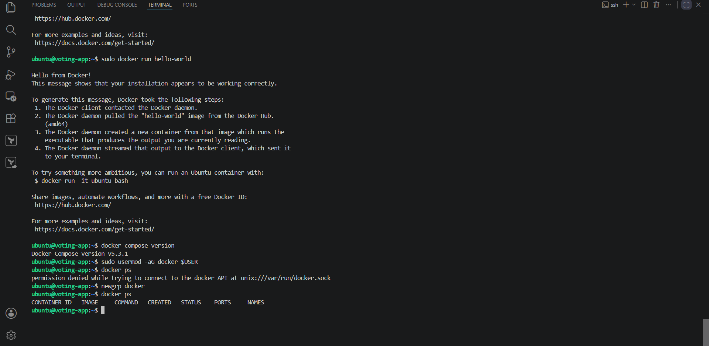

## 4. Build the Application Docker Images

With Docker successfully installed, the next step is to build Docker images for the three application services.

The application consists of the following services:

- **Vote** (Python/Flask)
- **Worker** (.NET)
- **Result** (Node.js)

Each service contains its own Dockerfile, which is used to package the application into a reusable Docker image.

> **Note**
>
> Redis and PostgreSQL use official Docker images from Docker Hub and therefore do **not** require local image builds.

### Build the Vote Image

Navigate to the Vote directory.

```bash
cd ~/voting-app-deployment/vote
```

Build the Docker image.

```bash
docker build -t vote:1.0 .
```

### Build the Worker Image

Navigate to the Worker directory.

```bash
cd ~/voting-app-deployment/worker
```

Build the Docker image.

```bash
docker build -t worker:1.0 .
```

### Build the Result Image

Navigate to the Result directory.

```bash
cd ~/voting-app-deployment/result
```

Build the Docker image.

```bash
docker build -t result:1.0 .
```

### Verification

Verify that all three images were created successfully.

```bash
docker images
```

Expected output should include:

- vote:1.0
- worker:1.0
- result:1.0

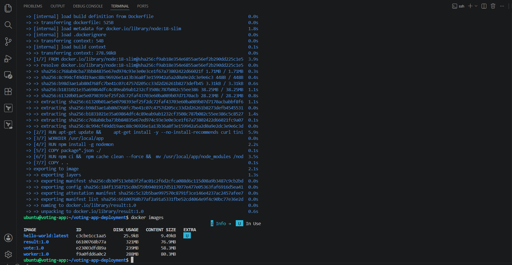

## 5. Create the Docker Network

To allow all application containers to communicate with one another, create a dedicated Docker bridge network.

> **Placeholder Note**
>
> Throughout this guide, the Docker network is named **tenet**. This is simply the network name used for this project. You are free to replace it with any name of your choice, provided the same name is used consistently throughout your Docker Compose configurations.

Create the network.

```bash
docker network create tenet
```

Verify that the network was created successfully.

```bash
docker network ls
```

### Verification

Ensure the **tenet** bridge network appears in the output.

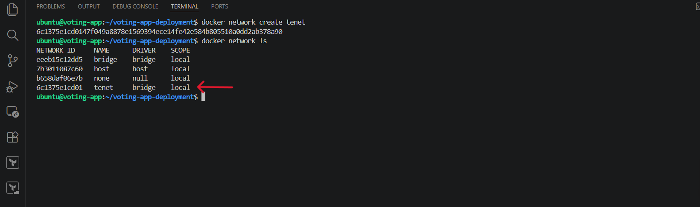

## 6. Deploy Redis and PostgreSQL

The application depends on Redis for temporary vote storage and PostgreSQL for persistent data storage.

Deploy both services using the official Docker Hub images.

### Deploy PostgreSQL

```bash
docker run -d \
  --name db \
  --network tenet \
  -e POSTGRES_HOST_AUTH_METHOD=trust \
  -e POSTGRES_USER=postgres \
  -e POSTGRES_PASSWORD=postgres \
  postgres:15-alpine
```

### Deploy Redis

```bash
docker run -d \
  --name redis \
  --network tenet \
  redis:alpine
```

Verify that both infrastructure containers are running.

```bash
docker ps
```

### Verification

Ensure both **db** and **redis** are running.

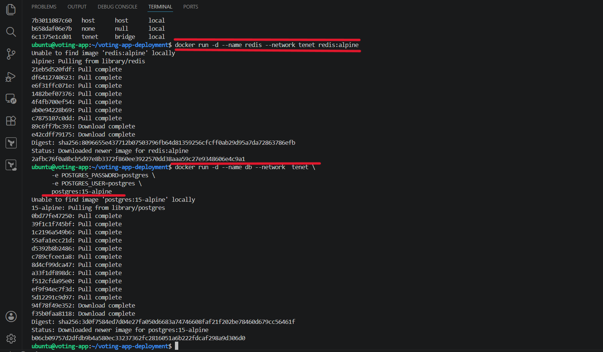

## 7. Deploy the Application Services

With the supporting infrastructure running, deploy the application services.

### Run the Vote Service

```bash
docker run -d \
  --name vote \
  --network tenet \
  -p 8080:80 \
  vote:1.0
```

### Run the Worker Service

```bash
docker run -d \
  --name worker \
  --network tenet \
  worker:1.0
```

### Run the Result Service

```bash
docker run -d \
  --name result \
  --network tenet \
  -p 8081:80 \
  result:1.0
```

Verify that every container is running.

```bash
docker ps
```

The output should display the following containers:

- vote
- worker
- result
- db
- redis

### Verification

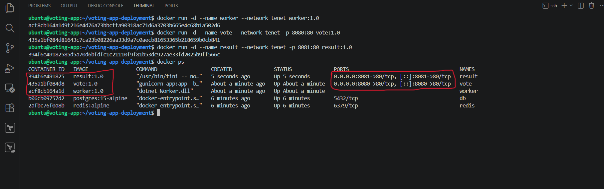

## 8. Verify the Complete Application

Open your web browser and navigate to the following URLs.

Vote application:

```text
http://<EC2_PUBLIC_IP>:8080
```

Result application:

```text
http://<EC2_PUBLIC_IP>:8081
```

Cast several votes through the Vote application and verify that the Result application updates accordingly.

This confirms that:

- The Vote service can communicate with Redis.
- The Worker service can retrieve votes from Redis.
- The Worker service can store votes in PostgreSQL.
- The Result service can retrieve processed votes from PostgreSQL.
- All containers can communicate successfully over the shared Docker network.

### Verification

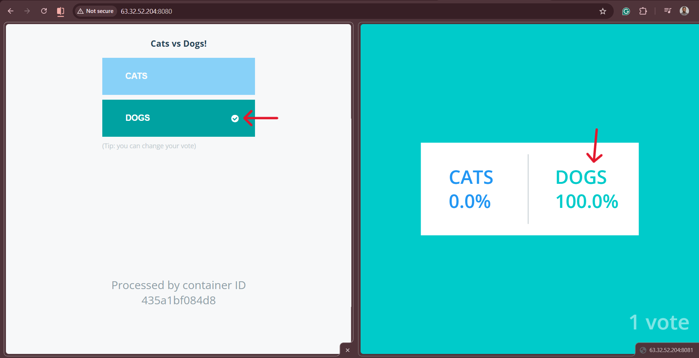

## 9. Remove the Containers and Images

Now that the application has been successfully deployed and verified manually, remove all running containers and locally built images.

This prepares the environment for the next phase, where the application will be deployed using Docker Compose and later automated with Jenkins.

Stop and remove all containers.

```bash
docker rm -f vote worker result db redis
```

Remove the locally built application images.

```bash
docker rmi vote:1.0 worker:1.0 result:1.0
```

Verify that the containers and images have been removed.

```bash
docker ps -a
```

```bash
docker images
```

### Verification

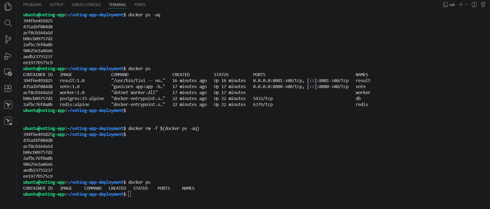

At this point, you have successfully completed the manual deployment of the application. More importantly, you now understand how each service is built, how the containers communicate over a shared Docker network, and how the complete application functions before introducing Docker Compose and CI/CD automation.

# Phase 2 – Docker Compose Deployment

After successfully deploying and validating the application manually, the next step is to simplify the deployment process using Docker Compose.

Instead of creating and managing each container individually with multiple `docker run` commands, Docker Compose allows the entire application stack to be defined declaratively in YAML files. This approach makes deployments easier to reproduce, simplifies container management, and lays the foundation for the CI/CD automation that will be implemented later in this guide.

## 10. Install and Use Docker Compose for Deployment

Begin by installing Docker Compose on your EC2 instance.

```bash
sudo apt install docker-compose-v2 -y
```

Verify the installation.

```bash
docker compose version
```

You should see the installed Docker Compose version.

Next, navigate to the project directory.

```bash
cd ~/voting-app-deployment
```

The root `docker-compose.yml` file will be used to deploy the application's shared infrastructure services.

These services include:

- PostgreSQL
- Redis

The application services are deployed using their own dedicated Docker Compose files:

- `vote/docker-compose.yml`
- `worker/docker-compose.yml`
- `result/docker-compose.yml`

This per-service architecture allows each application service to be deployed independently without affecting the remaining services.

## 11. Define Persistent Volumes for Redis and PostgreSQL

To ensure that application data persists even if the database containers are stopped or recreated, Docker volumes should be configured for both PostgreSQL and Redis.

Open the root Docker Compose file.

```bash
vi docker-compose.yml
```

Ensure that persistent volumes are configured for the database services as shown in the project repository.

> **Note**
>
> The complete `docker-compose.yml` used throughout this project is available here:
>
> - [`docker-compose.yml`](docker-compose.yml)

Using Docker volumes provides several benefits:

- Database data persists after container recreation.
- Application state is preserved across deployments.
- Containers can be replaced without losing stored data.

Verify that the Docker Compose file includes the required volume configuration.

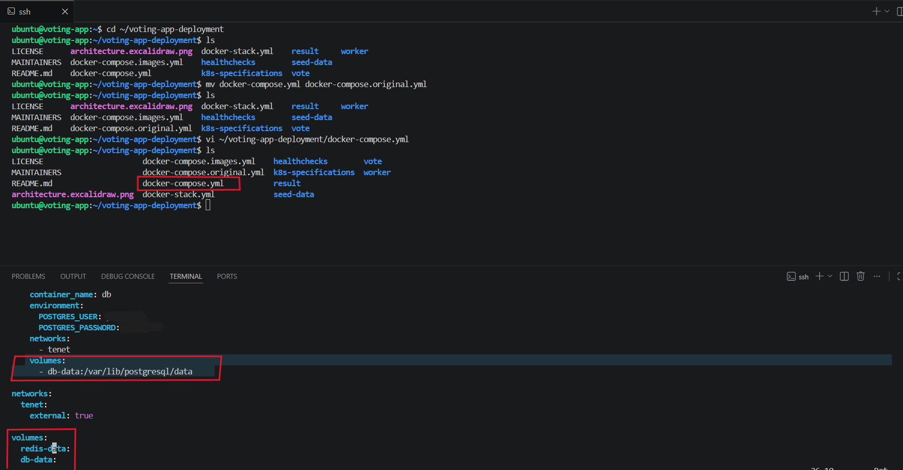

## 12. Create the Service-Specific Docker Compose Files

Unlike the original implementation where all services were managed from a single Docker Compose file, this project separates each application service into its own dedicated Compose configuration.

Create the following files:

```text
vote/docker-compose.yml
worker/docker-compose.yml
result/docker-compose.yml
```

Copy the corresponding configurations from this repository:

- [`vote/docker-compose.yml`](vote/docker-compose.yml)
- [`worker/docker-compose.yml`](worker/docker-compose.yml)
- [`result/docker-compose.yml`](result/docker-compose.yml)

This design allows Jenkins to deploy only the modified service during the CI/CD process while Redis, PostgreSQL, and the remaining application services continue running without interruption.

## 13. Deploy the Application Using Docker Compose

Navigate to the project root.

```bash
cd ~/voting-app-deployment
```

Deploy the shared infrastructure services.

```bash
docker compose up -d
```

Deploy the Vote service.

```bash
docker compose -f vote/docker-compose.yml up -d
```

Deploy the Worker service.

```bash
docker compose -f worker/docker-compose.yml up -d
```

Deploy the Result service.

```bash
docker compose -f result/docker-compose.yml up -d
```

Verify that all containers are running.

```bash
docker ps
```

The output should display:

- vote
- worker
- result
- db
- redis

Open your browser and verify that the application is functioning correctly.

Vote Application:

```text
http://<EC2_PUBLIC_IP>:8080
```

Result Application:

```text
http://<EC2_PUBLIC_IP>:8081
```

Cast several votes and confirm that the Result application updates accordingly.

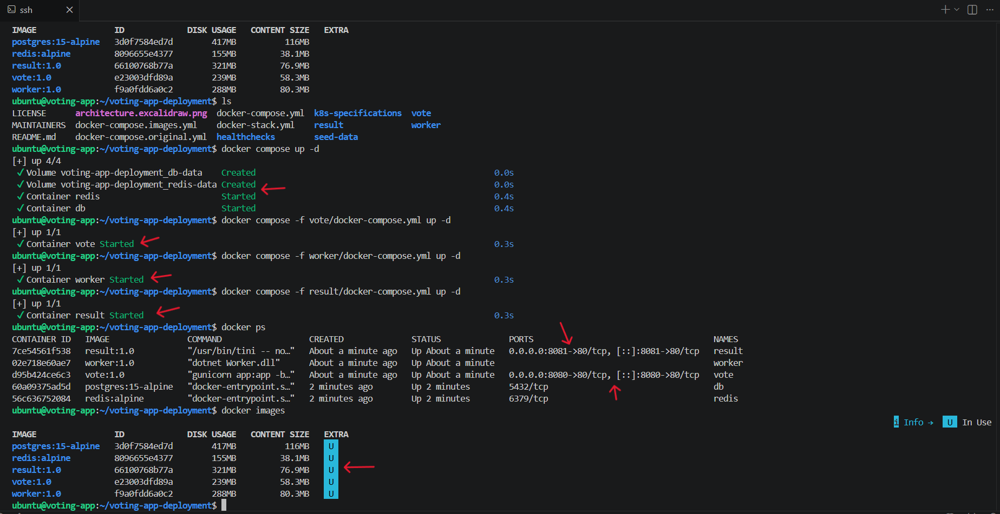

## 14. Push Each Service Image to Docker Hub

With the application successfully running through Docker Compose, the next step is to publish the application images to Docker Hub. These images will later be used by the Jenkins CI/CD pipelines during automated deployments.

Begin by logging in to Docker Hub.

```bash
docker login
```

When prompted, enter your Docker Hub username and password or Personal Access Token.

> **Placeholder Note**
>
> Throughout this guide, **ohjayy** is used as the Docker Hub namespace. Replace **ohjayy** with your own Docker Hub username.

### Tag the Vote Image

```bash
docker tag vote:1.0 ohjayy/vote:1.0
```

### Tag the Worker Image

```bash
docker tag worker:1.0 ohjayy/worker:1.0
```

### Tag the Result Image

```bash
docker tag result:1.0 ohjayy/result:1.0
```

Verify that the tagged images have been created.

```bash
docker images
```

Push the images to Docker Hub.

### Push the Vote Image

```bash
docker push ohjayy/vote:1.0
```

### Push the Worker Image

```bash
docker push ohjayy/worker:1.0
```

### Push the Result Image

```bash
docker push ohjayy/result:1.0
```

After the upload completes, verify that all three images appear in your Docker Hub repository.

These images will serve as the deployment artifacts used throughout the CI/CD implementation.

Docker Hub authentication.

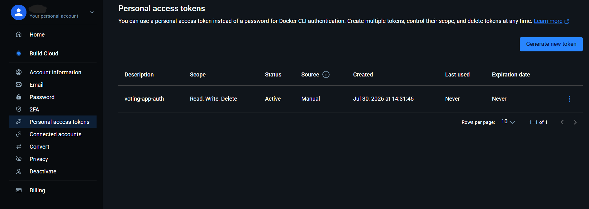

Docker image tagging.

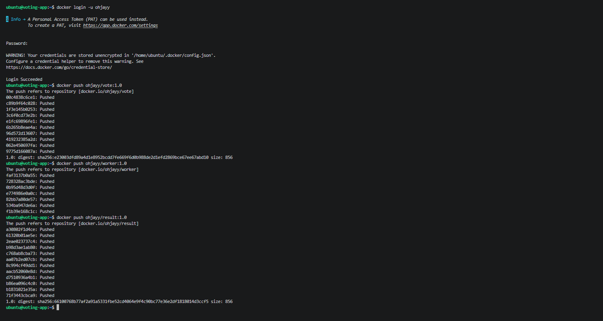

# Phase 3 – Jenkins Infrastructure

With the application successfully deployed using Docker Compose and the container images published to Docker Hub, the next step is to build the Continuous Integration (CI) infrastructure using Jenkins.

In this phase, you will provision a Jenkins Controller running inside a Docker container, create a dedicated Jenkins Build Agent, and connect both components to create a distributed build environment. This architecture separates the Jenkins management interface from the build environment, resulting in a cleaner, more scalable, and production-oriented CI setup.

## 15. Build the Jenkins Controller Image

Instead of using the official Jenkins image directly, this project uses a custom Jenkins Controller image. This custom image includes the Docker CLI and Docker Compose plugin, allowing Jenkins to build Docker images, interact with the Docker daemon running on the host, and execute deployment commands during the CI/CD process.

Navigate to your working directory.

```bash
cd ~
```

Create the Dockerfile.

```bash
vi Dockerfile.jenkins
```

Copy the Dockerfile from this repository.

- [`Dockerfile.jenkins`](Dockerfile.jenkins)

Build the custom Jenkins Controller image.

```bash
docker build -t jenkins-docker:1.0 -f Dockerfile.jenkins .
```

After the build completes successfully, verify that the image has been created.

```bash
docker images
```

You should see:

```text
jenkins-docker   1.0
```

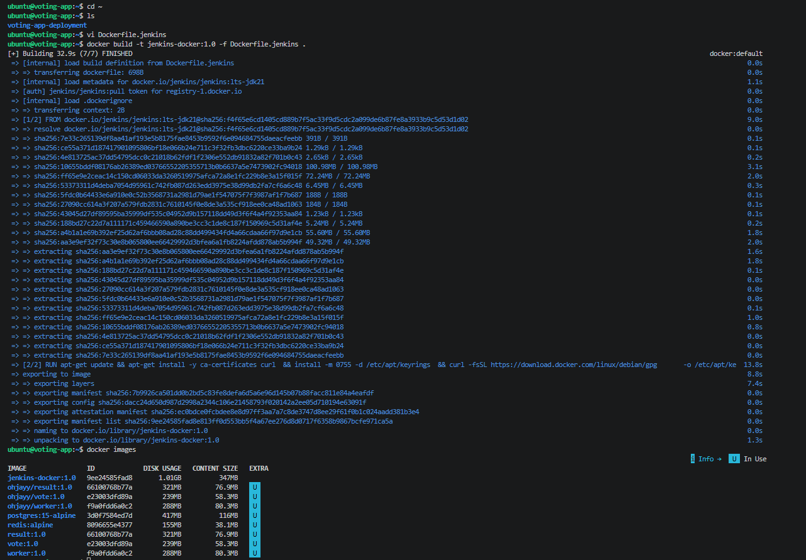

## 16. Deploy the Jenkins Controller Container

With the custom image successfully built, the next step is to deploy the Jenkins Controller container.

Run the following command exactly as shown.

```bash
docker run -d \
  --name jenkins \
  --restart unless-stopped \
  -p 8082:8080 \
  -p 50000:50000 \
  -v jenkins_home:/var/jenkins_home \
  -v /var/run/docker.sock:/var/run/docker.sock \
  jenkins-docker:1.0
```

This command performs the following:

- Creates a container named **jenkins**.
- Maps port **8082** on the EC2 instance to Jenkins port **8080** inside the container.
- Maps port **50000** for inbound Jenkins agents.
- Creates a persistent Docker volume for Jenkins data.
- Mounts the host Docker socket so Jenkins can control Docker running on the EC2 instance.

Verify that the container is running.

```bash
docker ps
```

The output should include the **jenkins** container.

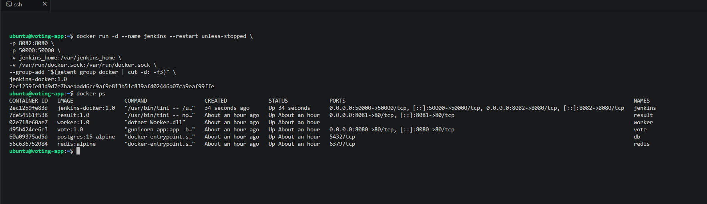

Open your browser and access the Jenkins web interface.

```text
http://<EC2_PUBLIC_IP>:8082
```

The Unlock Jenkins page should be displayed.

Retrieve the initial administrator password.

```bash
docker exec jenkins cat /var/jenkins_home/secrets/initialAdminPassword
```

Copy the generated password, paste it into the Unlock Jenkins page, and continue with the installation.

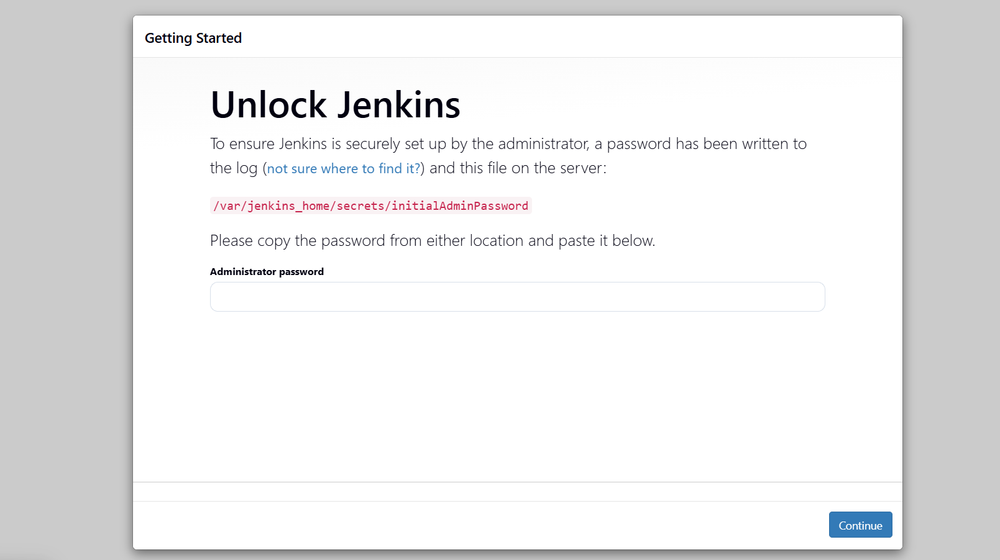

Select **Install Suggested Plugins** and wait for Jenkins to complete the installation.

Create your administrator account and complete the initial setup wizard.

After logging in successfully, the Jenkins dashboard should be displayed.

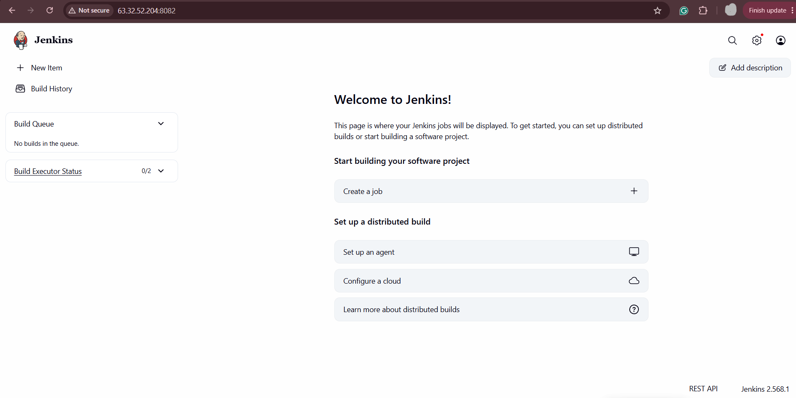

## 17. Configure Jenkins

After completing the Jenkins installation wizard, the next step is to configure a dedicated Jenkins build agent.

Using a build agent separates build execution from the Jenkins Controller, allowing the controller to focus on managing jobs while the agent performs the actual build and deployment tasks. This approach follows Jenkins best practices and provides a cleaner, more scalable CI/CD architecture.

From the Jenkins Dashboard, navigate to:

**Set Up a Distributed Build**, select **Set up an Agent**.

Click **New Node**.

Enter the following:

- **Node Name:** `build-agent`
- **Type:** Permanent Agent

Click **Create**.

Configure the agent using the following settings.

| Setting | Value |
|---------|-------|
| Name | `build-agent` |
| Description | `docker container agent` *(or any description of your choice)* |
| Number of Executors | `1` |
| Remote Root Directory | `/home/jenkins/agent` |
| Labels | `docker-builder` |
| Usage | `Use this node as much as possible` |
| Launch Method | `Launch agent by connecting it to the controller` |
| Availability | `Keep this agent online as much as possible` |
| Node Properties | Leave unchecked |

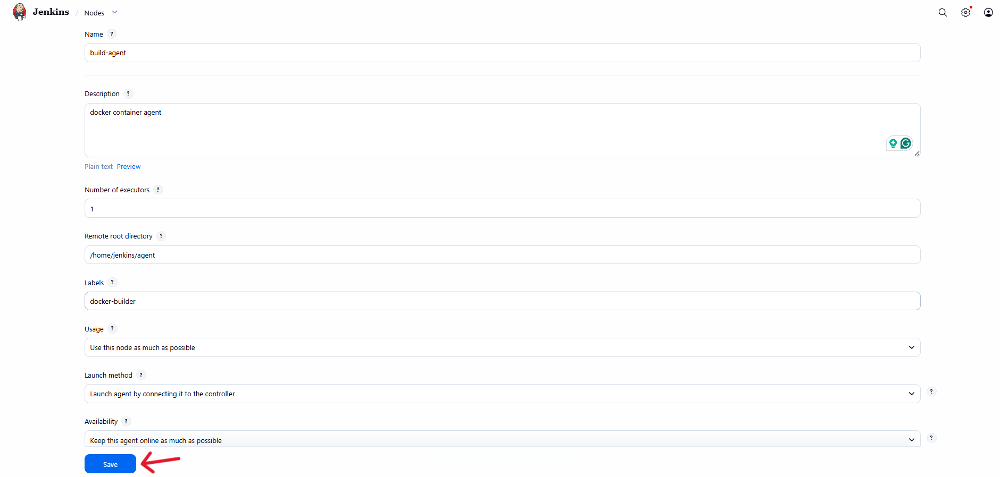

After completing the configuration, click **Save**.

You will be redirected to the **Nodes** page, where the newly created build agent should now appear.

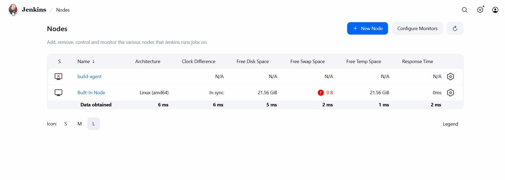

Next, click on the **build-agent** node.

Scroll down to the **Run from agent command line (Unix)** section.

Copy the **secret** displayed in the generated command. This secret will be required when connecting the Docker-based Jenkins build agent to the Jenkins Controller in the next step.

## 18. Create the Jenkins Build Agent

Rather than executing builds directly on the Jenkins Controller, this project uses a dedicated Jenkins Build Agent.

Separating the Controller from the build environment follows Jenkins best practices by allowing the Controller to manage jobs while the Build Agent performs the actual build and deployment tasks. This approach improves scalability, simplifies maintenance, and provides a cleaner CI/CD architecture.

Create the Build Agent Dockerfile.

```bash
vi Dockerfile.agent
```

Copy the Dockerfile from this repository.

- [`Dockerfile.agent`](Dockerfile.agent)

Build the Jenkins Build Agent image.

```bash
docker build -t jenkins-agent:1.0 -f Dockerfile.agent .
```

Verify that the image has been created successfully.

```bash
docker images
```

The output should include:

```text
jenkins-agent    1.0
```

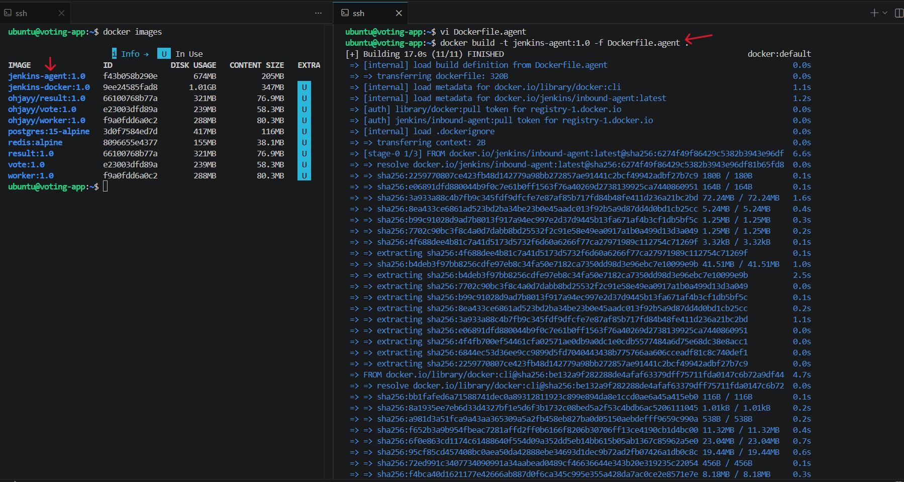

Next, start the Jenkins Build Agent container.

```bash
docker run -d --name jenkins-agent --restart unless-stopped \
    -v /var/run/docker.sock:/var/run/docker.sock \
    --group-add "$(getent group docker | cut -d: -f3)" \
    jenkins-agent:1.0 \
    -url http://<EC2_PUBLIC_IP>:8082 \
    -secret <AGENT_SECRET> \
    -name build-agent \
    -workDir /home/jenkins/agent
```

> **Placeholder. Replace:**
>
> - `<EC2_PUBLIC_IP>` with the public IP address of your EC2 instance.
> - `<AGENT_SECRET>` with the secret copied from the **Run from agent command line (Unix)** section in the previous step.

Verify that the Build Agent container is running.

```bash
docker ps
```

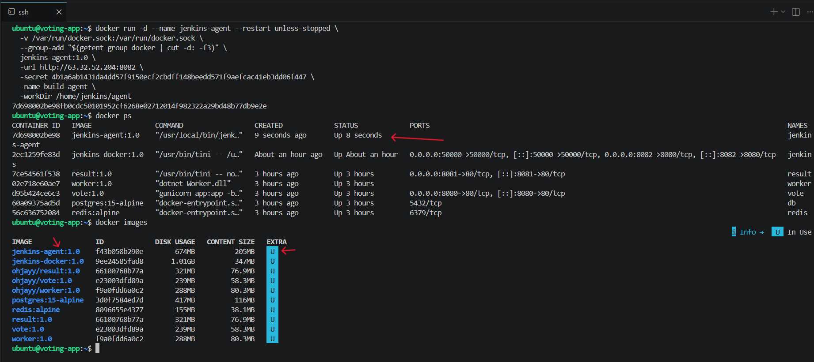

Return to the Jenkins Dashboard.

Navigate to:

```text
Manage Jenkins
→ Nodes
```

The **build-agent** should now display an **Online** status, confirming that it has successfully connected to the Jenkins Controller.

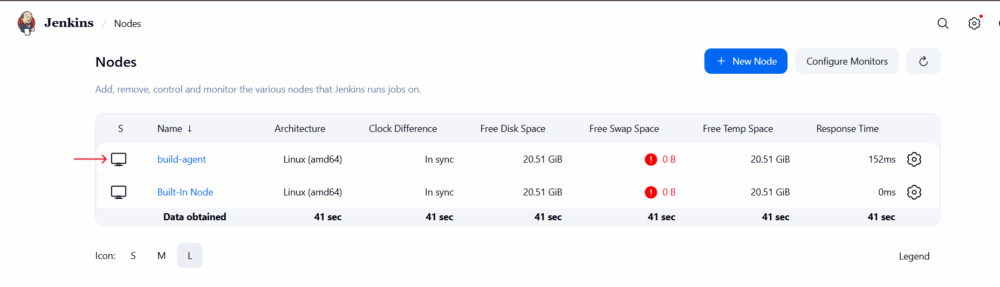

## 19. Configure Jenkins for Pipeline Execution

Before creating the CI/CD pipelines, complete the remaining Jenkins configuration.

Navigate to:

```text
Manage Jenkins
→ Security
```

Locate **TCP port for inbound agents** and ensure it is configured as:

```text
Fixed
50000
```

> **Note**
>
> Port **50000** was mapped earlier when the Jenkins Controller container was created. This allows inbound Jenkins Build Agents to connect successfully to the Controller.

Next, install the **Pipeline Stage View** plugin.

Navigate to:

```text
Manage Jenkins
→ Plugins
→ Available Plugins
```

Search for:

```text
Pipeline Stage View
```

Install the plugin and restart Jenkins if prompted.

The Pipeline Stage View plugin provides a visual representation of every stage within a Jenkins pipeline, making it easier to monitor build progress, identify failures, and troubleshoot CI/CD workflows.

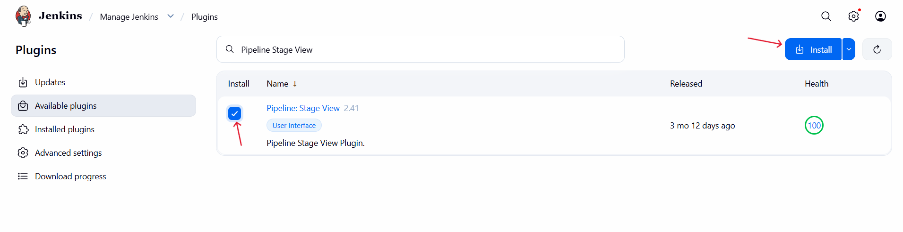

# Phase 4 – Repository Preparation & CI/CD Pipelines

With the Jenkins infrastructure fully configured, the next phase is to prepare the repository for automated deployments and implement the CI/CD pipelines for each application service.

To keep the project modular and maintainable, each microservice is given its own:

- Jenkins pipeline
- Deployment script
- Docker Compose configuration

This design allows Jenkins to rebuild and redeploy only the modified service, significantly reducing deployment time while preventing unnecessary interruptions to the remaining services.

## 20. Restructure the Project Repository

The original project used in this implementation was cloned from the **Docker Example Voting App** repository. Since this project focuses specifically on **Docker, Docker Compose, and Jenkins CI/CD**, several files included in the original repository are outside the scope of this implementation.

To keep the repository organised and focused on the technologies being implemented, move the Docker Swarm configuration, Kubernetes manifests, and seed data into a dedicated **extras** directory. These files are retained for future reference but are not required for this Docker Compose and Jenkins CI/CD deployment.

From the project root, create a directory for files that are not used in this project.

```bash
mkdir extras
```

Move the Docker Swarm configuration into the new directory.

```bash
mv docker-stack.yml extras/
```

Move the seed data into the new directory.

```bash
mv seed-data extras/
```

Move the Kubernetes manifests into the new directory.

```bash
mv k8s-specifications extras/
```

Move the health check scripts into the new directory.

```bash
mv healthchecks extras/
```

Next, create a directory to store the deployment scripts.

```bash
mkdir deploy
```

Inside the **deploy** directory, create the deployment scripts.

```bash
touch deploy/vote.sh
touch deploy/worker.sh
touch deploy/result.sh
touch deploy/rollback.sh
```

Create a Jenkinsfile for each application service.

```bash
touch vote/Jenkinsfile
touch worker/Jenkinsfile
touch result/Jenkinsfile
```

Optionally, create a root Jenkinsfile for future orchestration.

```bash
touch Jenkinsfile
```

Verify the updated project structure.

```bash
tree
tree -L 2
tree -d
ls -l
```

The project structure should now resemble the following.

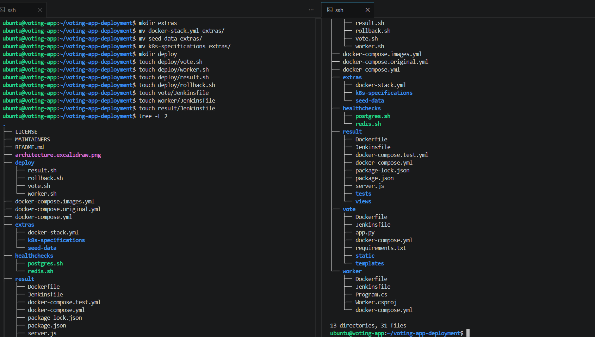

## 21. Configure the Deployment Scripts

Rather than embedding deployment logic directly inside the Jenkins pipelines, this project separates Continuous Integration (CI) from Continuous Deployment (CD).

Each Jenkins pipeline is responsible for:

- Checking out the latest source code.
- Retrieving the current Git commit SHA.
- Building the Docker image.
- Tagging the image.
- Publishing the image to Docker Hub.

Once these tasks have completed successfully, control is passed to a dedicated deployment script.

The deployment scripts are responsible for:

- Pulling the latest image from Docker Hub.
- Recreating only the affected application service.
- Validating that the deployment completed successfully.
- Automatically executing the rollback script if deployment validation fails.

This separation keeps each Jenkinsfile clean and makes it easy to replace the deployment mechanism in the future without modifying the CI pipeline.

Create the Vote deployment script.

```bash
cd ~/voting-app-deployment/deploy
vi vote.sh
```

Copy the deployment script from:

- [`deploy/vote.sh`](deploy/vote.sh)

Create the rollback script.

```bash
vi rollback.sh
```

Copy the rollback script from:

- [`deploy/rollback.sh`](deploy/rollback.sh)

Make both scripts executable.

```bash
chmod +x deploy/vote.sh
chmod +x deploy/rollback.sh
```

> **Note**
>
> The remaining application services reuse the same deployment strategy. Their deployment scripts will be configured later in this guide using the same approach.

## 22. Configure the Vote Service Pipeline

The Vote service is used as the reference implementation for the CI/CD architecture. Once this pipeline has been configured, the Worker and Result pipelines can be created by following the same process with only minor changes.

### Configure the Jenkinsfile

Navigate to the Vote service directory.

```bash
cd ~/voting-app-deployment/vote
```

Create or edit the Jenkinsfile.

```bash
vi Jenkinsfile
```

Copy the pipeline from:

- [`vote/Jenkinsfile`](vote/Jenkinsfile)

### Create the Jenkins Pipeline Job

Open the Jenkins Dashboard.

Click:

```text
New Item
```

Configure the pipeline as follows.

**Name**

```text
vote-pipeline
```

**Type**

```text
Pipeline
```

Click **OK**.

Under **General**:

- Enter a pipeline description.
- Enable **GitHub project**.
- Enter your GitHub repository URL.

Under **Build Triggers**:

Enable:

```text
GitHub hook trigger for GITScm polling
```

Under **Pipeline**:

Change:

```text
Pipeline script
```

to

```text
Pipeline script from SCM
```

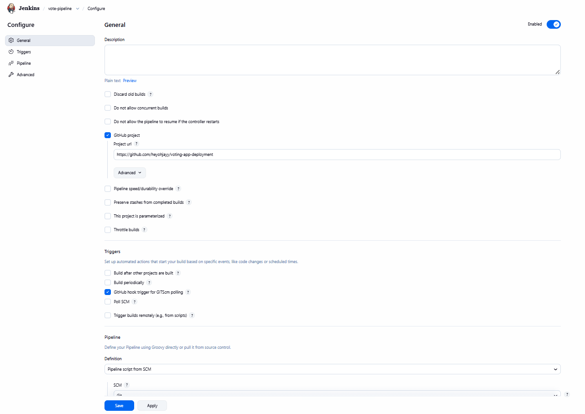

Configure the SCM settings.

| Setting | Value |
|----------|-------|
| SCM | Git |
| Repository URL | Your GitHub repository |
| Branch Specifier | `*/feature/voting-app-cicd` |
| Script Path | `vote/Jenkinsfile` |

### Configure GitHub Credentials

Under **Credentials**, click:

```text
Add → Jenkins
```

Configure the credential.

| Setting | Value |
|----------|-------|
| Kind | Username with password |
| Username | Your GitHub username |
| Password | GitHub Personal Access Token (PAT) |
| ID | `github-credentials` |

These credentials allow Jenkins to securely authenticate with your GitHub repository when checking out the project source code during pipeline execution.

Select **github-credentials** from the Credentials dropdown.

The completed configuration should resemble the image below.

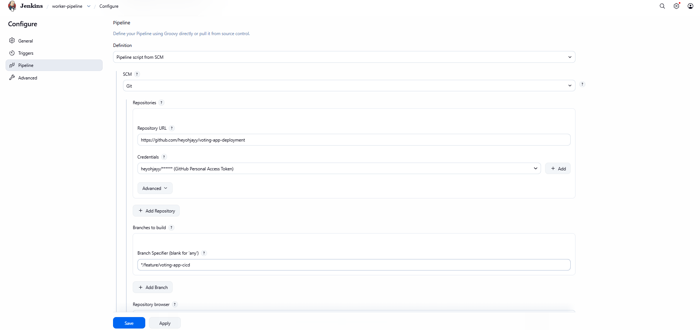

### Configure Docker Hub Credentials

Create a second credential for Docker Hub.

Click:

```text
Add → Jenkins
```

Configure:

| Setting | Value |
|----------|-------|
| Kind | Username with password |
| Username | Your Docker Hub username |
| Password | Docker Hub Personal Access Token |
| ID | `dockerhub-credentials` |

These credentials allow Jenkins to securely authenticate with Docker Hub when publishing newly built Docker images during the CI/CD process.

Click **Save**.

## 23. Configure the Worker Service Pipeline

The Worker service pipeline is configured using the same procedure as the Vote service pipeline.

Navigate to the Worker service directory.

```bash
cd ~/voting-app-deployment/worker
```

Create or edit the Jenkinsfile.

```bash
vi Jenkinsfile
```

Copy the pipeline from:

- [`worker/Jenkinsfile`](worker/Jenkinsfile)

Create a new Jenkins Pipeline named:

```text
worker-pipeline
```

Repeat the same pipeline configuration completed in the previous step with the following changes only:

| Setting | Value |
|----------|-------|
| Pipeline Name | `worker-pipeline` |
| Script Path | `worker/Jenkinsfile` |

All other Jenkins configuration, GitHub credentials, Docker Hub credentials, Build Triggers, and SCM settings remain exactly the same as the Vote service pipeline.

The completed Worker pipeline configuration should resemble the following.


## 24. Configure the Result Service Pipeline

The Result service pipeline is configured using the same process as both the Vote and Worker service pipelines.

Navigate to the Result service directory.

```bash
cd ~/voting-app-deployment/result
```

Create or edit the Jenkinsfile.

```bash
vi Jenkinsfile
```

Copy the pipeline from:

- [`result/Jenkinsfile`](result/Jenkinsfile)

Create a new Jenkins Pipeline named:

```text
result-pipeline
```

Repeat the same pipeline configuration completed in **Step 22** with the following changes only:

| Setting | Value |
|----------|-------|
| Pipeline Name | `result-pipeline` |
| Script Path | `result/Jenkinsfile` |

All other Jenkins configuration, GitHub credentials, Docker Hub credentials, Build Triggers, and SCM settings remain exactly the same as the Vote service pipeline.

The completed Result pipeline configuration should resemble the following.

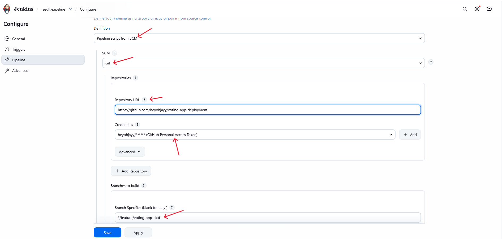

## 25. Configure Slack Notifications

The final component of the CI/CD pipeline is Slack integration.

Slack provides real-time notifications whenever a pipeline succeeds, fails, or is aborted, allowing deployment status to be monitored without constantly checking the Jenkins Dashboard.

### Install the Slack Notification Plugin

From the Jenkins Dashboard, navigate to:

```text
Manage Jenkins
→ Plugins
→ Available Plugins
```

Search for:

```text
Slack Notification Plugin
```

Install the plugin.

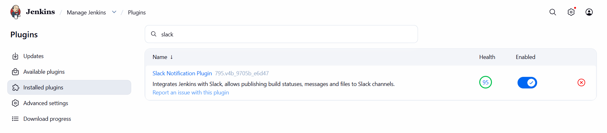

### Create a Slack App

Ensure you're logged in on your slack account then,

Open:

```text
https://api.slack.com/apps
```

Click:

```text
Create New App

↓

From scratch
```

Enter the following:

| Setting | Value |
|----------|-------|
| App Name | Jenkins Vote-App Notifications |
| Workspace | Select your Slack workspace |

The names used above are placeholders. Feel free to use any name of your choice.

Click **Create App**.

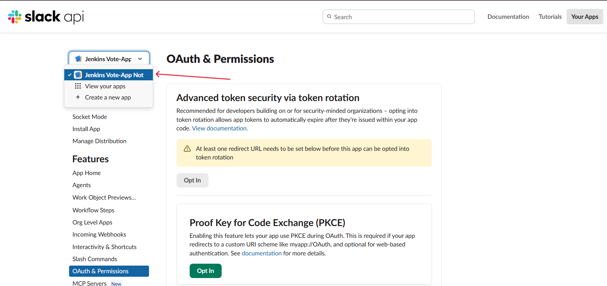

### Configure OAuth Permissions

From the Slack App dashboard in the image above, navigate to:

```text
OAuth & Permissions
```

Scroll to:

```text
Scopes
→ Bot Token Scopes
```

Click:

```text
Add an OAuth Scope
```

Add the following permission.

```text
chat:write
```

Scroll back to the top of the page.

Click:

```text
Install to Workspace
```

Approve the installation.

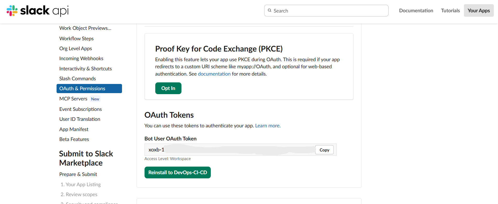

After the installation completes, copy the **Bot User OAuth Token**.

Example:

```text
xoxb-********************************
```

This token will be used as the Jenkins credential in the next step.

### Configure Slack in Jenkins

Return to the Jenkins Dashboard.

Navigate to:

```text
Manage Jenkins
→ System
```

Scroll down to the **Slack** section.

Configure the Workspace.

| Setting | Value |
|----------|-------|
| Workspace | Your Slack workspace name |

> **Note**
>
> If your Slack workspace URL is:
>
> ```text
> https://myworkspace.slack.com
> ```
>
> Enter only:
>
> ```text
> myworkspace
> ```
>
> Do **not** include `https://` or `.slack.com`.

Next, configure the Slack credential.

Click:

```text
Add
→ Global credentials
```

Configure the credential.

| Setting | Value |
|----------|-------|
| Kind | Secret text |
| Secret | Paste the Bot User OAuth Token |
| ID | `slack-token` |
| Description | Slack Bot Token |

Click **Create**.

Select:

```text
slack-token
```

Configure the default channel.

```text
#jenkins-builds
```

> **Note**
>
> If you don't have a slack channel, make sure to create one and replace **#jenkins-builds** with your preferred Slack channel in `Defaut channel/member id`

Enable:

```text
☑ Custom slack app bot user
```

Invite the Slack bot into your channel.

```text
/invite @Jenkins Vote-App
```

Click:

```text
Test Connection
```

A successful connection returns SUCCESS and confirms that Jenkins can communicate with your Slack workspace.

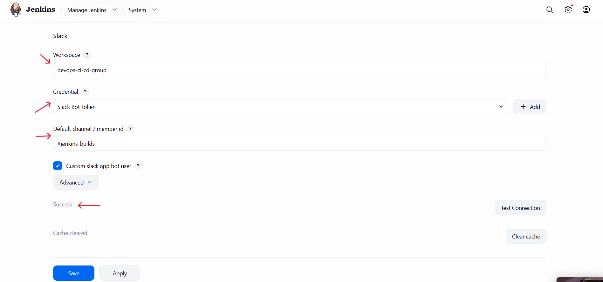

Finally, click **Save**.

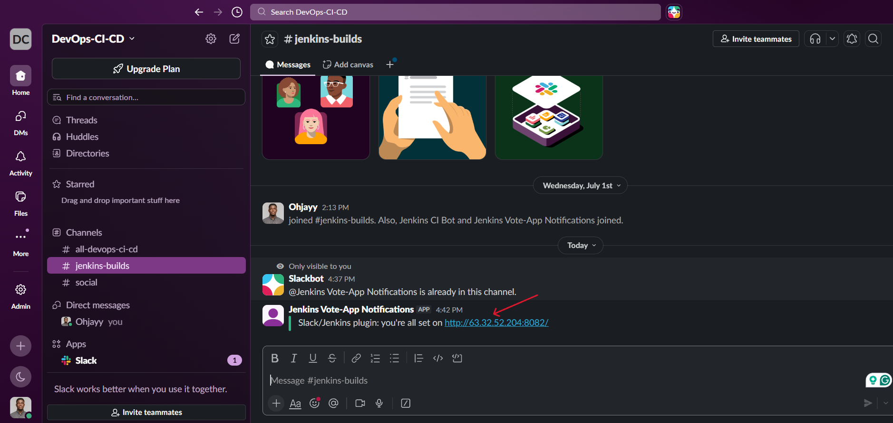

### Configure Pipeline Notifications

Open the Vote Jenkinsfile.

```bash
cd ~/voting-app-deployment/vote
```

```bash
vi Jenkinsfile
```

Add the **post** section shown in the repository to the bottom of the Jenkinsfile.

The complete configuration is available here:

- [`vote/Jenkinsfile`](vote/Jenkinsfile)

Ensure that the `environment` block contains:

```groovy
SLACK_CHANNEL = "#jenkins-builds"
```

Repeat the same Slack notification configuration for:

- [`worker/Jenkinsfile`](worker/Jenkinsfile)
- [`result/Jenkinsfile`](result/Jenkinsfile)

Finally, verify the following before proceeding:

- `vote-pipeline` exists.
- `worker-pipeline` exists.
- `result-pipeline` exists.
- GitHub credentials are configured.
- Docker Hub credentials are configured.
- Slack credentials are configured.
- All deployment scripts are executable.

At this point, all Jenkins pipelines are fully configured and ready for automatic execution.

> **NOTE:**
> The above step was implemented as an afterthought to ensure the Jenkinsfile contains the needed command to trigger a post-build action; in this case, a Slack notification. Since you already copied the script from [`vote/Jenkinsfile`](vote/Jenkinsfile), you may not have to perform this step.

## 26. Configure the GitHub Webhook

The final integration step is connecting GitHub to Jenkins using a webhook.

This allows GitHub to automatically notify Jenkins whenever new code is pushed to the repository, eliminating the need to trigger pipeline executions manually.

Open your GitHub repository.

Navigate to:

```text
Settings
→ Webhooks
→ Add webhook
```

Configure the webhook as follows.

| Setting | Value |
|----------|-------|
| Payload URL | `http://<JENKINS_SERVER_IP>:8082/github-webhook/` |
| Content Type | `application/json` |
| Events | Just the push event |

> **Placeholder Note**
>
> Replace `<JENKINS_SERVER_IP>` with the public IP address of your Jenkins server.

Click **Add webhook** to save the configuration.

Once configured, every push to the configured branch will automatically trigger the corresponding Jenkins pipeline.

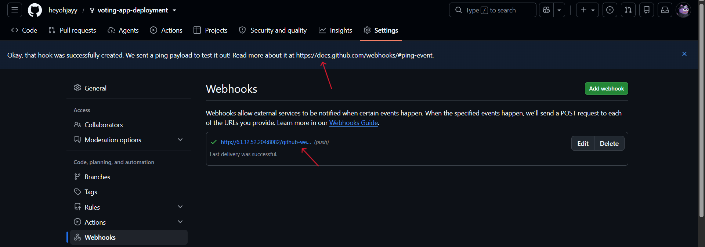

# Phase 5 – End-to-End CI/CD Validation

At this stage, the CI/CD platform is fully configured.

The remaining steps validate that every component of the deployment workflow operates correctly—from a Git push, through Jenkins, Docker Hub, automated deployment, and finally Slack notifications.

Successful completion of this phase confirms that the entire CI/CD pipeline is functioning as intended.

## 27. Push the Feature Branch to GitHub

Navigate to the project directory.

```bash
cd ~/voting-app-deployment
```

Verify the current Git status.

```bash
git status
```

Ensure all changes have been committed.

If required, stage and commit the changes.

```bash
git add .
```

```bash
git commit -m "Implement per-service Docker Compose deployment and Jenkins CI/CD pipeline for the voting application"
```

Push the feature branch.

```bash
git push -u origin feature/voting-app-cicd
```

If the upstream branch has already been configured, subsequent pushes can be completed using:

```bash
git push
```

After the push completes successfully, GitHub should confirm that the feature branch has been updated.

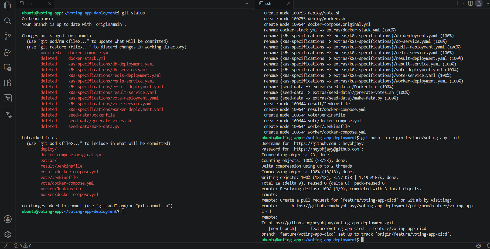

## 28. Trigger the Jenkins Pipelines

After the GitHub webhook has been configured, every push to the configured branch automatically triggers the appropriate Jenkins pipeline.

No manual intervention is required.

Navigate to the Jenkins Dashboard.

Open each pipeline and monitor the execution.

The pipeline should execute the following stages successfully:

1. Checkout Source
2. Get Git Commit SHA
3. Build Docker Image
4. Tag Docker Image
5. Docker Hub Login
6. Push Docker Image
7. Docker Hub Logout
8. Deploy Service

A successful pipeline indicates that:

- Jenkins successfully checked out the latest source code.
- The Docker image was built successfully.
- The image was tagged using the Git commit SHA.
- The image was pushed to Docker Hub.
- The deployment script completed successfully.
- The updated service was deployed without affecting the remaining services.

The completed pipeline should resemble the following.

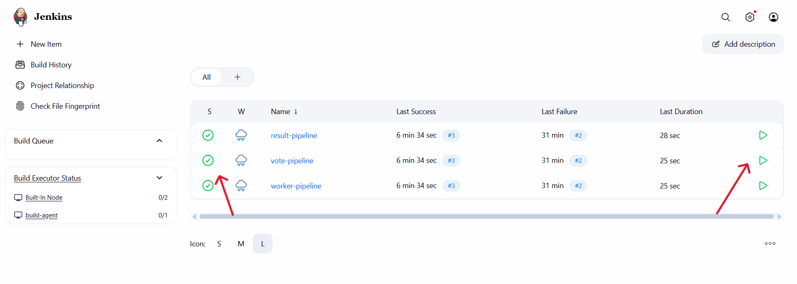

The Pipeline Stage View should display every stage as successful.

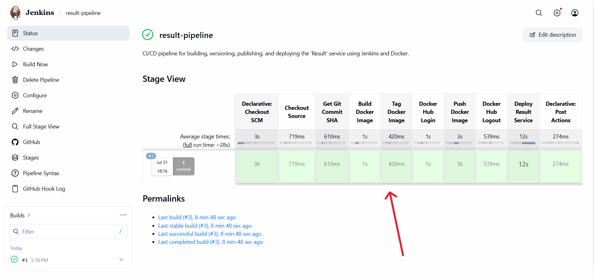

## 29. Verify Docker Hub Image Publishing

Open Docker Hub.

Navigate to your repositories.

Each application should now contain newly published images tagged with the corresponding Git commit SHA.

Verify that the following repositories contain the latest images.

- vote
- worker
- result

Example:

```text
ohjayy/vote:a8baf3c
ohjayy/worker:a8baf3c
ohjayy/result:a8baf3c
```

The appearance of newly tagged images confirms that Jenkins successfully authenticated with Docker Hub and published the build artifacts.

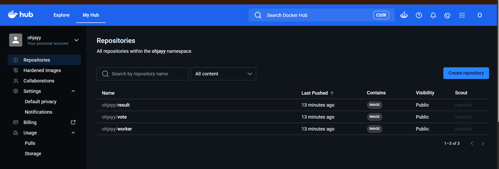

## 30. Verify Service Deployment

After Docker Hub publishing completes successfully, the deployment scripts automatically deploy the updated service.

Verify that the application containers are running.

```bash
docker ps
```

The following containers should remain online.

- vote
- worker
- result
- redis
- db

Open the application in your browser.

Vote Application:

```text
http://<EC2_PUBLIC_IP>:8080
```

Result Application:

```text
http://<EC2_PUBLIC_IP>:8081
```

Submit several votes.

Confirm that:

- Votes are successfully submitted.
- Results update correctly.
- Existing services remain online during deployment.
- Only the modified service is recreated.

This validates that the deployment scripts successfully perform rolling service updates without affecting the rest of the application.

## 31. Verify Slack Build Notifications

Return to your Slack workspace.

Open the configured build notifications channel.

A notification should be generated automatically after every pipeline execution.

Each notification should include:

- Pipeline name.
- Build number.
- Build status.
- Timestamp.
- Link to the Jenkins build.

Successful notifications confirm that Jenkins can communicate with Slack using the configured bot token.

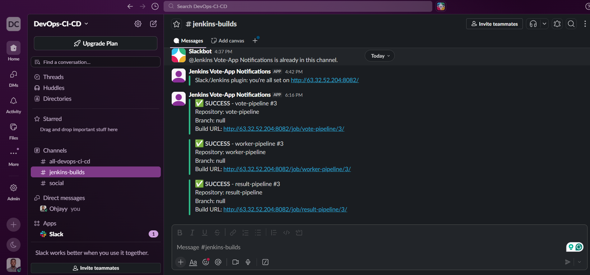

## 32. Troubleshooting

The following troubleshooting guide documents **some of the issues encountered during the development of this project** and the solutions used to resolve them.

Since these issues have already been identified and addressed during implementation, you may not encounter the same problems while reproducing this project. However, if you do, the solutions below should help you resolve them quickly.

<details>
<summary><strong>1. Docker image cannot be tagged</strong></summary>

### Error

```text
Error response from daemon:
No such image: ohjayy/result:latest
```

### Cause

The Docker Compose file was building the image using:

```yaml
image: result:1.0
```

while the Jenkins pipeline expected:

```text
ohjayy/result:latest
```

### Solution

Update each service-specific Docker Compose file so that the image name matches the repository referenced inside the Jenkins pipeline.

Example:

```yaml
image: ohjayy/result:latest
```

Repeat the same correction for the Vote and Worker services.

</details>

<details>
<summary><strong>2. Deployment script returns "no such service"</strong></summary>

### Error

```text
no such service: result
```

### Cause

The deployment script executed:

```bash
docker compose up -d result
```

from the project root, where the root Docker Compose file manages only Redis and PostgreSQL.

### Solution

Reference the service-specific Docker Compose file.

Example:

```bash
docker compose \
-f result/docker-compose.yml \
up -d result
```

Repeat the same correction for the Vote and Worker deployment scripts.

</details>

<details>
<summary><strong>3. Jenkins Build Agent remains Offline</strong></summary>

### Cause

The Jenkins Build Agent failed to authenticate with the Jenkins Controller.

Common causes include:

- Incorrect agent secret
- Incorrect Jenkins URL
- TCP port **50000** not configured
- Incorrect agent name

### Solution

Verify:

- The copied agent secret matches the one generated by Jenkins.
- The agent name matches the configured node.
- TCP port **50000** is enabled under:

```text
Manage Jenkins
→ Security
```

Recreate the Build Agent container if necessary.

</details>

<details>
<summary><strong>4. GitHub webhook does not trigger Jenkins</strong></summary>

### Cause

GitHub cannot communicate with the Jenkins webhook endpoint.

### Solution

Verify:

- The Jenkins server is publicly accessible.
- Port **8082** is reachable.
- The webhook URL ends with:

```text
/github-webhook/
```

- The pipeline has **GitHub hook trigger for GITScm polling** enabled.

</details>

<details>
<summary><strong>5. Docker Hub authentication fails</strong></summary>

### Cause

The configured Docker Hub credentials are incorrect or the Personal Access Token has expired.

### Solution

Generate a new Docker Hub Personal Access Token.

Update the Jenkins credential:

```text
dockerhub-credentials
```

Run the pipeline again.

</details>

<details>
<summary><strong>6. Slack notifications are not delivered</strong></summary>

### Cause

The Slack Bot User OAuth Token is invalid, the bot has not been invited to the notification channel, or the Slack workspace configuration is incorrect.

### Solution

Verify:

- The **slack-token** credential contains the correct Bot User OAuth Token.
- The Slack bot has been invited to the notification channel.

```text
/invite @<Your Slack Bot Name>
```

- The configured workspace and channel names are correct.

Run the pipeline again.

</details>

<details>
<summary><strong>7. Deployment validation fails</strong></summary>

### Cause

The deployment script could not verify that the updated container started successfully.

### Solution

Inspect the running containers.

```bash
docker ps
```

Review the application logs.

```bash
docker logs vote
docker logs worker
docker logs result
```

If deployment validation fails, the rollback script automatically restores the previous Docker image, allowing the application to remain available while the issue is investigated.

</details>

Congratulations! You have successfully implemented a production-oriented, microservices-based CI/CD platform using Docker, Docker Compose, Jenkins, GitHub, Docker Hub, Slack, and AWS EC2. The completed solution supports automated builds, per-service deployments, Docker image versioning using Git commit SHAs, automated rollback, and real-time deployment notifications.

